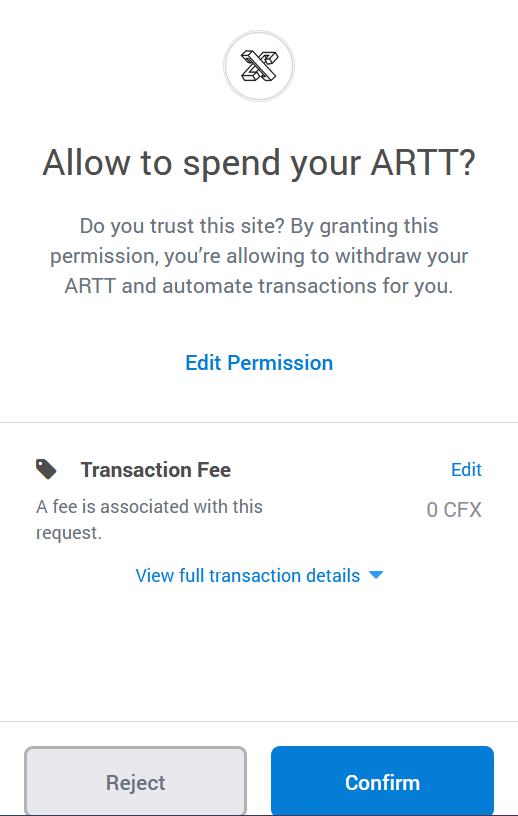
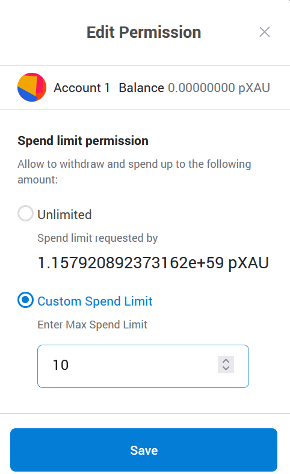

# 授权安全

## 什么是授权Aprrove

授权(Approve)，就是允许另外一个钱包（可以是普通的个人钱包，也可以是智能合约钱包），在除Approve操作外，不通知你的前提下，使用你的部分资产。

## 为什么需要授权Approve操作

用Conflux网络举例，由于CFX是原生资产，在向目标智能合约转账或交互的时候，本身会携带CFX资产到目标合约中；而非原生资产CRC20代币在向目标合约转账时，只是更改CRC20代币合约本身的账本信息，用户实际交互的目标合约不会收到任何通知，因此approve操作是告知CRC20代币合约，将来某授权钱包或合约地址可以划转发起授权交易账户的资产。

## 哪些场景可能会需要授权操作

一般情况下，只有涉及到和合约交互（DApp、DeFi等），需要对合约进行授权的时候，才会进行授权（Approve）操作。例如使用fc参与Ins3承保，flux存款，koichiswap换出FC买入cfx时，需要调用FC的智能合约授权Ins3，flux及koichiswap项目的合约地址可划转用户钱包中的fc代币。

- **所以，当你在使用Portal的过程中，出现以下界面的时候，就是在向你询问授权（Approve）操作，那就一定要多加小心，多次确认当前你访问的链接是否是安全、可信的，才可以继续操作！**

- 用户可通过点击Portal中的“Edit Permission”修改授权额度

!!! warning
	授权（Approve），是允许第三方在不通知你的前提下，划转你的资产。往最严重的情况说，就是对方在你不知道的情况下，可以把你的某个资产全部转走。因此，如果你给一些不明来历的第三方应用进行授权，是存在着巨大的安全隐患的！ 所以，遇到授权（Approve）的时候，一定要小心！一定要确定对方代码是否开源，对方是否有做代码审计，对方团队是否是可信任的等等！在授权前请确认您是否能信任对应合约的开发者，如无法信任，请一定点击Reject！
