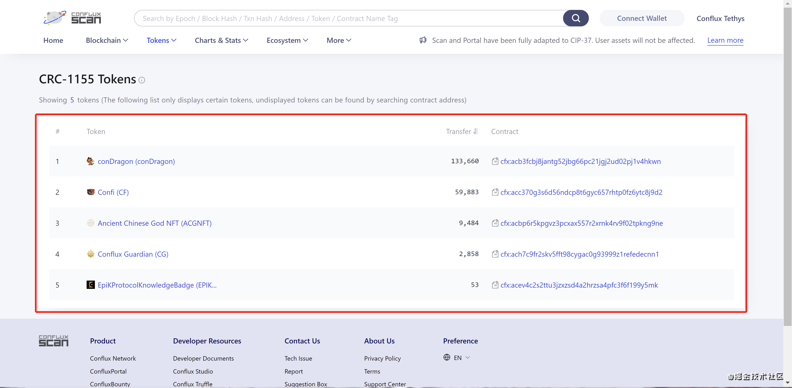

# NFT查看器教程

ConfluxScan区块浏览器新增了NFT查看的功能，可以通过搜索地址查看某一账户拥有的 NFT（仅支持当前代币列表中的 NFT）。

## 操作步骤

- 进入[ConfluxScan官网]()，点击菜单栏最右的"More/更多"，在下拉栏列表中选择“NFT Checker/ NFT查看器”。

- 在"NFT Checker"输入框中输入想查询的账户地址，便可以看到该账户拥有的 NFT。

!!! note

​	** 注：查看器中仅显示当前代币列表中的 NFT（即CRC-1155代币列表中的NFT）。**

- 输入钱包地址，并点击搜索按钮，如下图可查看到钱包地址内的NFT

## 说明

**NFT查看器中仅显示当前代币列表中的 NFT（即CRC-1155代币列表中的NFT），不在代币列表中的NFT不予显示，但不代表这个NFT就不存在了。**

## 查看能够被Scan显示的NFT列表

- 在菜单栏中选择“Tokens/代币”，在下拉栏中选择“CRC-1155 Tokens/CRC-1155 代币”。页面中显示的CRC-1155代币就是可以在NFT查看器中显示的NFT。

- 目前已支持显示conDragon, Confi（烤仔城市），Ancient Chinese God NFT（古国序列），Conflux Guardian（守护者），Epik协议NFT

## 如何让你的NFT被ConfluxScan收录

作为NFT发起方，如何在Scan上展示NFT：[如何在Scan上注册合约和代币展示 ](https://conflux-wiki.github.io/conflux-wiki/development/register-contract-and-token-display/)