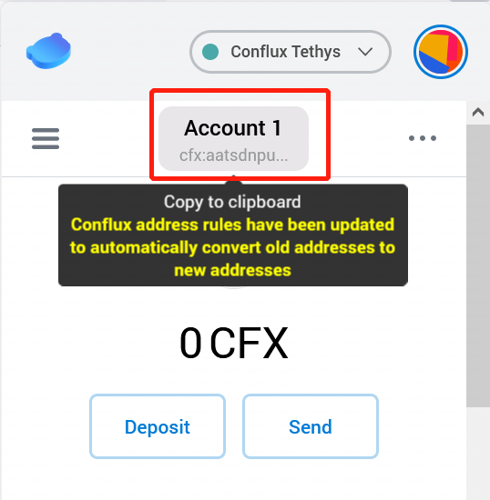
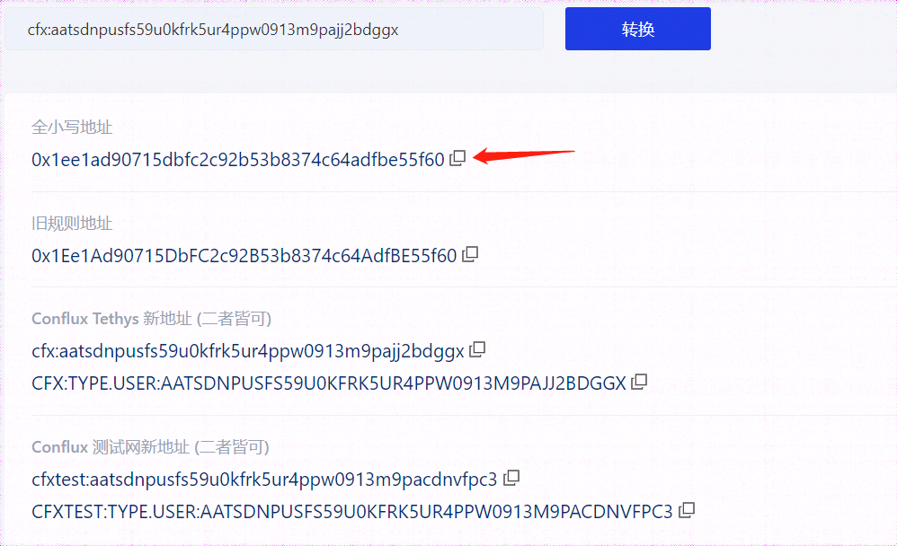

# 地址转换工具

## 背景介绍
随着Bounty2.0的上线公测，越来越多的用户要准备提现其账户内未满足最低提现标准的FC代币，由于FC合约需要用户将接收地址从现有Conflux主网地址(cfx:aa起头的一串字符)转换为旧规则地址(0x1起头的一串十六进制字符)

## 地址转换工具链接

- [地址格式转换工具链接](https://confluxscan.io/address-converter)

## 地址转换工具使用方法

1. 解锁Portal钱包，复制新规则下您需要提现FC代币的钱包地址

2. 将新规则钱包地址粘贴至地址格式转换工具中

3. 点击转换按钮即可获取转换后地址，以FC代币提现地址为例，复制“全小写地址”即可

4. 提现时一定要注意地址的正确性，否则会出现失败问题。