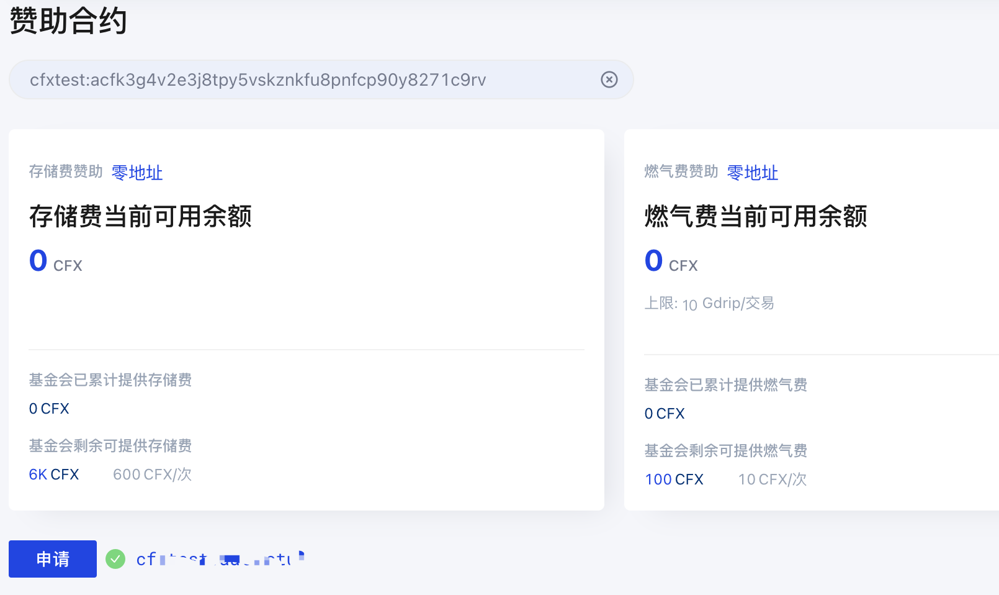
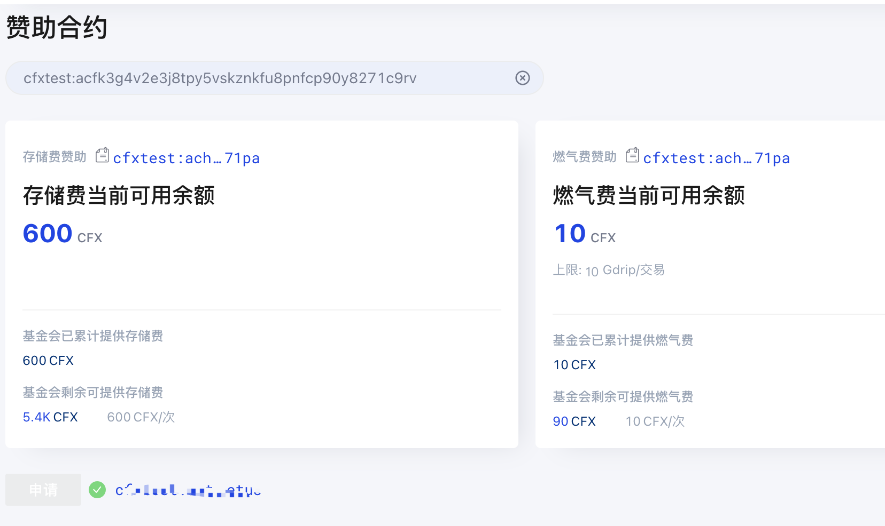

# 为合约申请Conflux赞助额度（合约代付）

## 目的

为便于项目冷启动，一个余额为零的新账户就能够调用合约。Conflux提供了部分CFX作为可赞助的代付额度为智能合约的使用提供补助。智能合约开发者可以为自己的项目合约申请代付额度，大大方便新手体验优质生态。针对合约代付的介绍还可参考[新项目如何高效启动？Conflux 代付机制了解一下](https://juejin.cn/post/6904212662629236749/)。

## 两类Conflux网络

- Conflux测试网：[测试网Scan](https://testnet.confluxscan.io/)
- Conflux正式网：[正式网Scan](https://confluxscan.io/)

## 说明及操作步骤

点击链接访问**正式网区块浏览器Scan**或**测试网区块浏览器Scan**

- 以测试网Scan为例：点击左上角区块链---赞助合约

- 会出现以下界面：输入**合约地址**后回车，可以查看当前的代付情况，若为0或者很小的时候说明需要新的代付了，存储费为storage代付，**每次为600cfx，燃气费为gas代付，10cfx（gas代付一般一次就够，主要是storage的费用较高）**

- 找一个已部署好的合约地址，如：cfxtest:acfk3g4v2e3j8tpy5vskznkfu8pnfcp90y8271c9rv

（此合约没有特殊意义，如需代付所有地址，需要在代码中加上SponsorWhitelistControl 相关代码，合约程序员请移步[代付合约]()的编写）查询之后发现，合约没有任何代付额度，这个时候点击申请

- 连接钱包

- 随便选择一个有cfx的钱包，因为需要支付0.125cfx的费用（之后再用当前地址申请代付，就不再消耗cfx了）

- 左下角显示地址即可点击申请

- 之后点击确认再等待确认即可

- 关闭交易哈希框，之后自动查询结果：

!!! info

​	当“申请”按钮变成灰色，存储费600cfx，燃气费10cfx，则说明申请成功，接下来你就可以无需支付任何gas费用就能够与您开发的智能合约进行交互了！