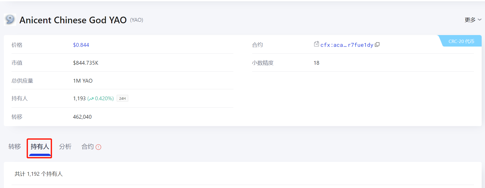
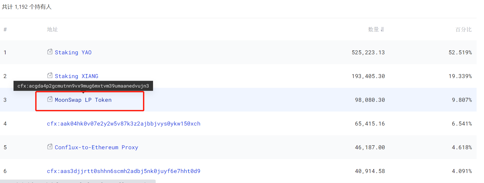
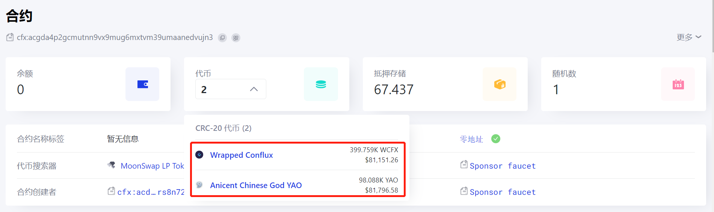
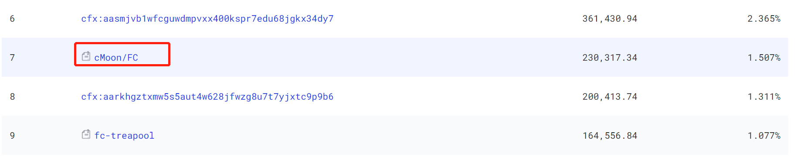

# 查找LP代币的合约地址

由于部分生态项目存在转移LP代币的需求，[Conflux Portal](https://conflux-wiki.github.io/conflux-wiki/development/portal/)用户可以通过参考[添加 CRC20 代币到 Portal 的方法与步骤-合约地址自定义添加 LP](https://conflux-wiki.github.io/conflux-wiki/development/add-token-to-portal/#3lp)的方法添加LP至Portal代币列表中并进行转账操作，本文将给出如何利用Conflux Scan的方法，找到合约地址

## 以查找yao/cfx这一LP对为例

**考虑到CFX持有人很多，很难通过查询CFX持有人排名的方式获取到yao/cfx这一合约地址，所以我们可以换个思路，以yao为查找对象，最终通过查询yao的持有人排名找到对应的yao/cfx合约地址。**

- 访问[ConfluxScan](https://confluxscan.io/)，在搜索框内输入“yao”

- 点进去，发现有一个持有人栏目

- 发现一个可能的的持有人，名为“MoonSwap LP Token”

- 点进去一探究竟，发现确实是我们需要找的LP对（原因是通过合约锁住了yao/cfx两种代币）：其中cfx做了Wrapped的处理，wcfx与cfx之间可1:1兑换，具体可参考[WCFX 与 CFX 代币互换](https://conflux-wiki.github.io/conflux-wiki/ecosystem/wcfx-cfx-exchange/)

复制LP代币合约地址：cfx:acgda4p2gcmutnn9vx9mug6mxtvm39umaanedvujn3

## 以查找fc/moon这一LP对为例

**考虑到FC的持有人和moon的持有人都还算稳定，可以以fc为查找对象，最终找到对应的fc/moon合约地址。**

访问[Conflux CRC20列表](https://confluxscan.io/tokens/crc20)，可以找到FC代币

点进去查看代币持有人

发现可能的LP持有地址链接

点进去一探究竟，发现是CFX和FC的LP合约，LP合约地址为：cfx:acg9nhwyrb592kjthzukgwv4k2kyxajepab1fz6ywf

回退到上一页，发现持有人内有cMoon/FC

点进去查看，发现符合moon/FC配对特征

该LP地址为：cfx:aca45uhpk2d1j7vf8y927mr79w4bzne0vyfg9muytu

## 最简单的查找方法

直接搜索“MLP”关键字

