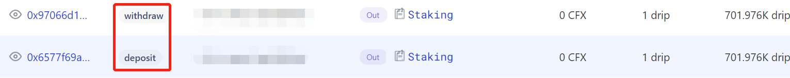

# 交易分析

## 利用ConfluxScan分析Staking合约内部交互情况

- 相关交易在Scan处的显示如下图所示，质押调用deposit函数，提取调用withdraw函数

- 点击上图中deposit函数名左侧的交易哈希链接->内部交易后发现：deposit函数需要用户地址向Staking合约转账149.352CFX，以质押享受4.08%年化，如下图所示：

- 点击withdraw函数名左侧的交易哈希链接->内部交易后发现：withdraw函数会从使Staking合约向用户地址转账149.352CFX，同时还会将利息CFX以**增发的形式**转账至用户地址处，因此此时用户将收到149.352+0.276=149.628CFX：

