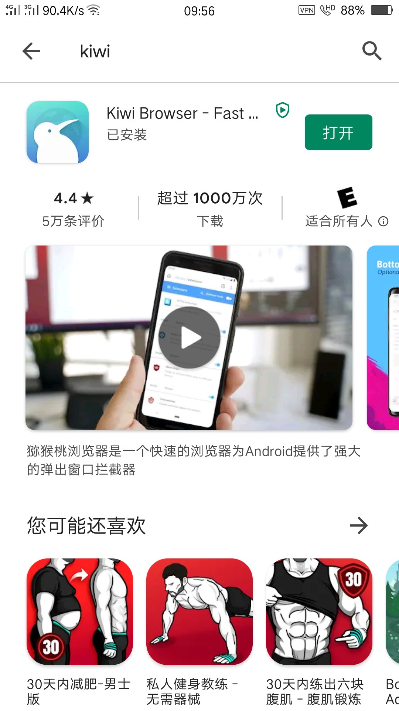
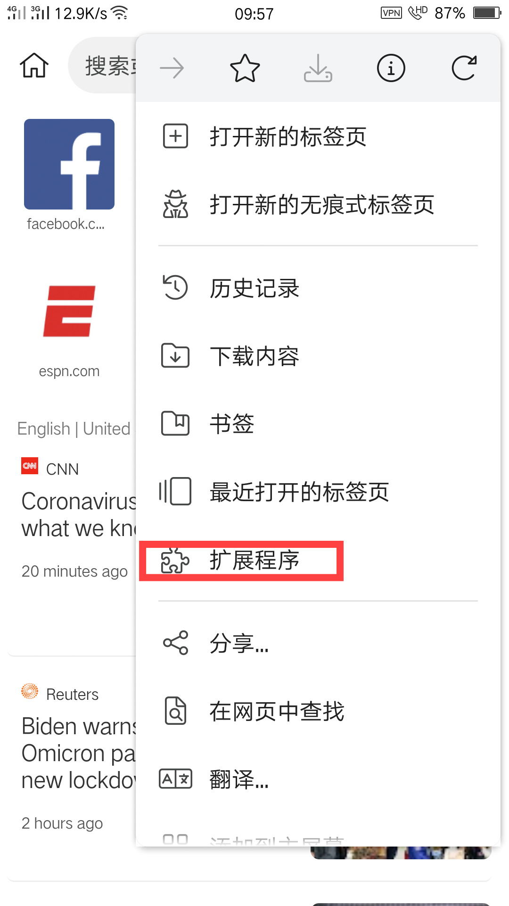
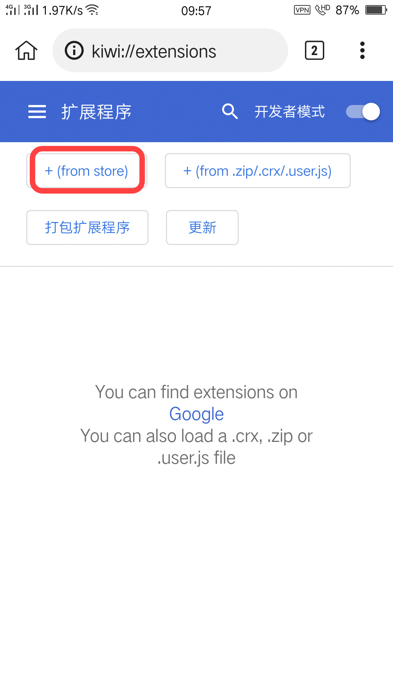
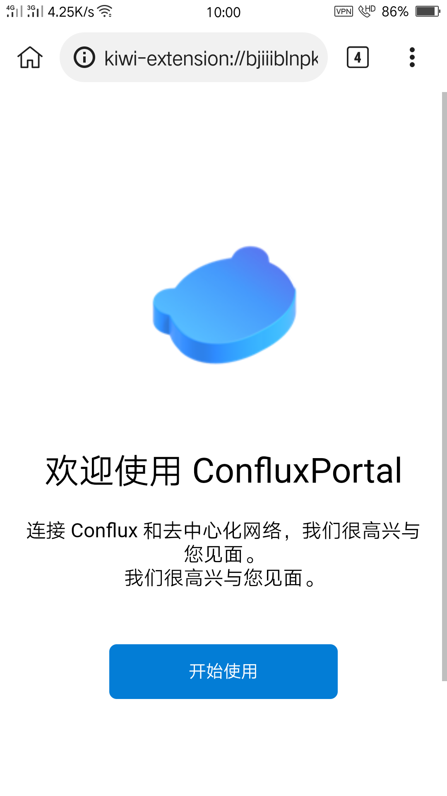

# 手机安装fluent钱包

## 背景
部分同志因手头没电脑，但部分生态项目（如三角DAO，governance质押）尚不支持手机版本，因此我们需要将手机改造一下，让他支持运行电脑版的fluent钱包，使之能够与这些尚未适配手机版本的生态。手机安装KIWI浏览器，在KIWI安装Conflux fluent钱包。以后体验起来方便多了。

## 配置步骤

- 魔法上网，谷歌商店搜KIWI浏览器，下载安装。

- KIWI浏览器，访问扩展程序功能

- 在弹出的扩展界面中选择“from store”

- 弹出Google应用商店，搜fluent，添加至Chrome。

- 安装完成，创建新钱包，创建钱包教程与[电脑版安装Portal过程](https://conflux-wiki.github.io/conflux-wiki/development/portal/#portal_1)类似，注意备份好助记词

## 鸣谢
本文参考aloner[手机安装ConfluxPortal，玩TriangleDAO协议](https://forum.conflux.fun/t/confluxportal-triangledao/12522)，经润色调整后编写，图片仍沿用aloner提供的素材。

