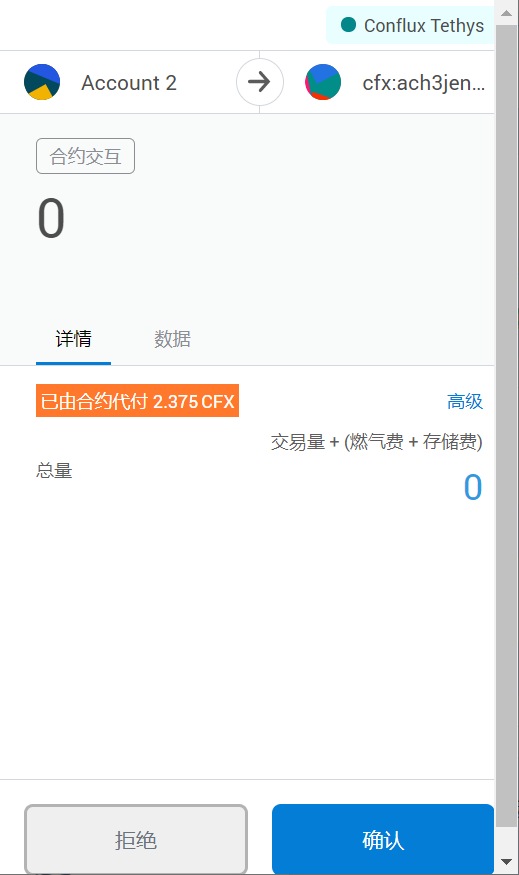
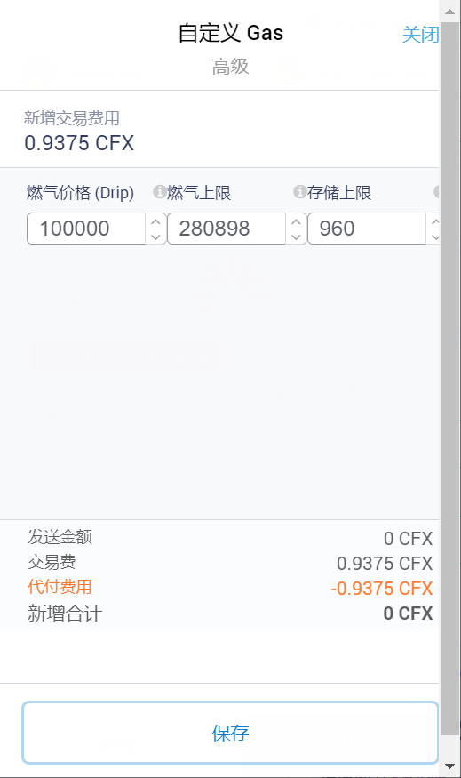
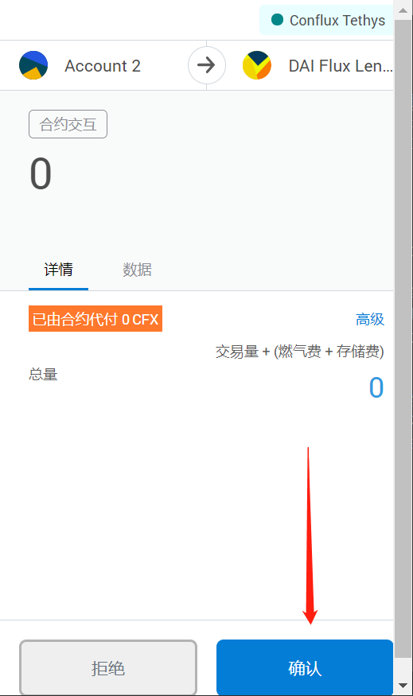

# 交易drip介绍

## 背景介绍
- [【公告】关于11月3日Conflux Tethys网络出现交易拥堵情况说明](https://forum.conflux.fun/t/11-3-conflux-tethys/11775)
- [Conflux 中的代付机制详解](https://forum.conflux.fun/t/conflux/11949)

## 燃料drip介绍

现在Conflux网络中默认的GAS是1Drip，也就是0.00000000000000001 CFX，由于转账的成本比较低，所以这次出现的上千万笔转账代付的手续费算在一起也不到1CFX，是几乎可以忽略不计的。

所谓网络拥堵就是有人用1Drip的转账的手续费大量转账，每秒1500～2800笔交易甚至更高，这恰恰证明了Conflux的高性能，如果你用其他的公链就破产了。但对于其他普通的用户再去用默认的1Drip的转账的手续费转账，那这个交易就可能不会被打包了，需要慢慢排队，大致上和以太坊 Gas price 的逻辑一样的。

如果有用户希望自己的交易快点完成，那就提高一点点 Gas 的价格就可以，现在的话 10 Drip（0.0000000000000001 CFX）就可以大幅提升转账的速度，如果不放心， Gas 的价格提高到1 GDrip（0.000000001 CFX）也可以，都是几乎可以忽略不计的。换算如下图所示：

## 使用Portal，提高drip方法

- 发起一笔合约交互

- 点击高级，调整交互花费的drip，从1drip调整为100000drip

- 点击保存，确认交易

- 交易会较快的被执行，查看Confluxscan可看到花费的Gas情况

