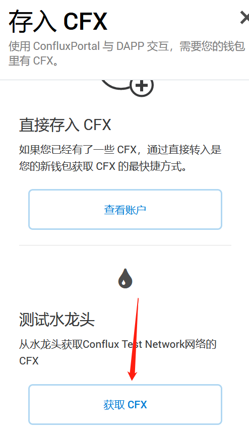
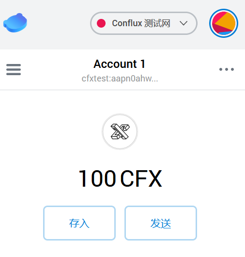
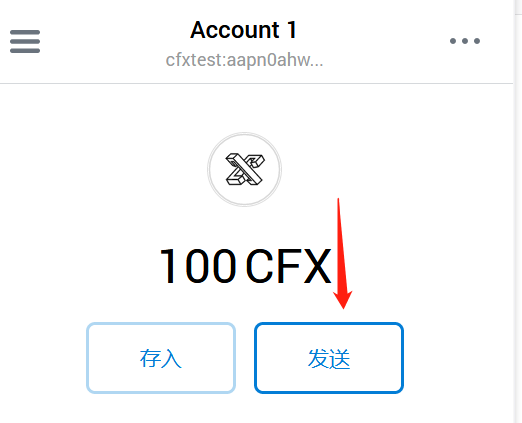
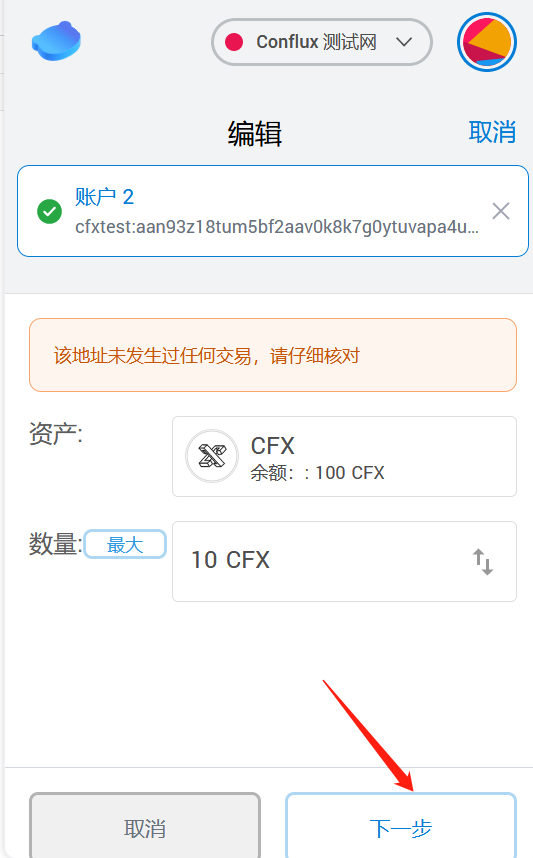
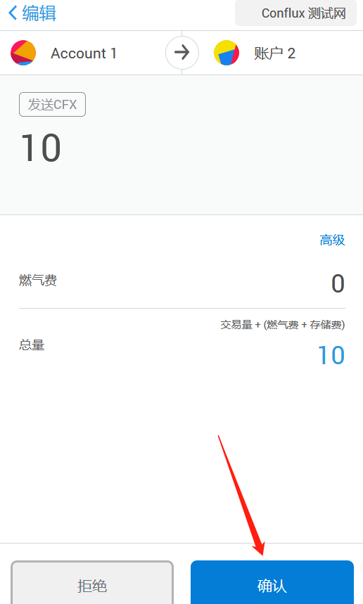
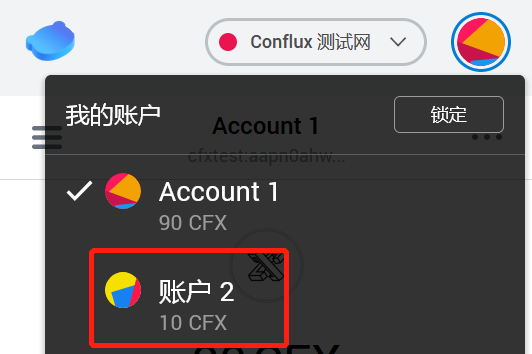
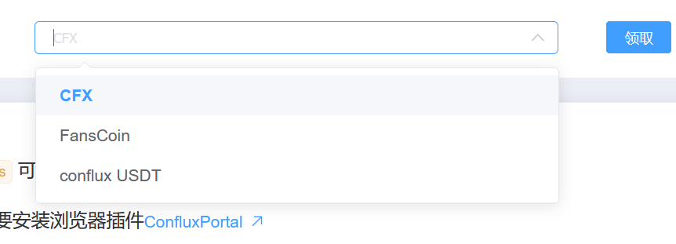
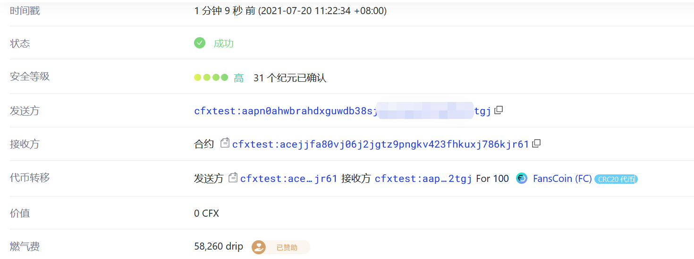

# ConfluxPortal切换为测试网领取测试币教程

使用 Conflux Portal 钱包，连入 Conflux 测试网，领取测试币，可在 Conflux 测试网环境下体验测试币的交易或测试开发中的生态项目。

Portal安装教程可参考本wiki内提供的：[配置教程](https://conflux-wiki.github.io/conflux-wiki/development/portal/)

## 基本方法介绍

- 使用Portal内自带的faucet接口
- 使用测试网络连接[Conflux faucet dapp](http://faucet.confluxnetwork.org/)

## Portal接口申请测试CFX基本步骤

- 切换网络操作可参考[网络切换](https://conflux-wiki.github.io/conflux-wiki/development/portal-setting/#_1)
- 点击存入

- 拉到页面下侧并点击“获取CFX”按钮

- 弹出页面，给出交易txid：

- 再次查看Portal，发现已存入100CFX

!!! note

​	每个地址一小时内只能领取一次测试币，一小时内再次点击“获取CFX”会弹出领取失败的通知。

尝试转账cfx

添加CFX接收方（一般复制一个地址）：

点击确认：

状态从待处理变为已执行

发现账户2确实多了10cfx

## 进阶方法：直接与官方提供的测试网dapp交互

Conflux官方为测试网也实现了一款dapp，支持CFX、FC和CUSDT的faucet，dapp[链接](http://faucet.confluxnetwork.org/)

使用测试网络访问上述链接：

点击“连接钱包”，这时Portal会弹出：

点击后，Portal窗口消失页面出现变化：

支持3种代币

选择FansCoin

点击领取按钮

点击Portal内确认按钮，发起合约交互

点击交易哈希，可发现已接收100FC：

!!! note

​	接下来还有一步，需要让我们在Portal中添加FC这个代币，方法，请参考[法 2：合约地址自定义添加代币](https://conflux-wiki.github.io/conflux-wiki/development/add-token-to-portal/#2)，而合约地址已在下文给出。

## 测试网合约地址列表

[测试网FC合约Scan地址](https://testnet.confluxscan.io/address/cfxtest:achkx35n7vngfxgrm7akemk3ftzy47t61yk5nn270s)：cfxtest:achkx35n7vngfxgrm7akemk3ftzy47t61yk5nn270s

[测试网cUSDT合约Scan地址](https://testnet.confluxscan.io/address/cfxtest:acepe88unk7fvs18436178up33hb4zkuf62a9dk1gv)：cfxtest:acepe88unk7fvs18436178up33hb4zkuf62a9dk1gv

