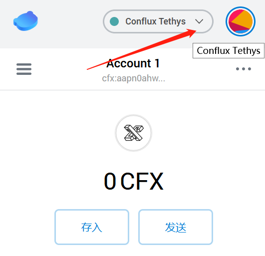
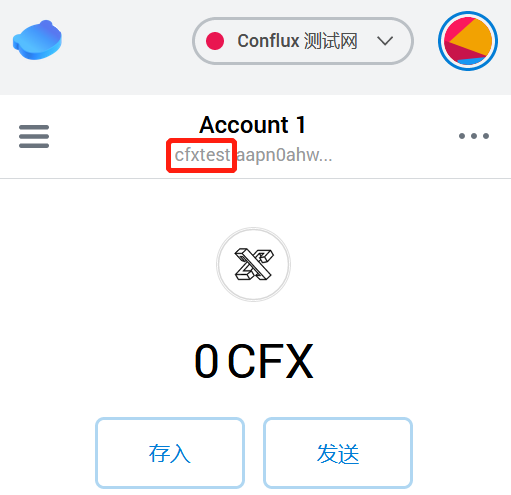
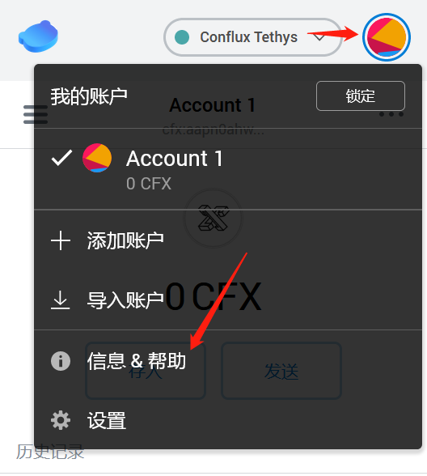
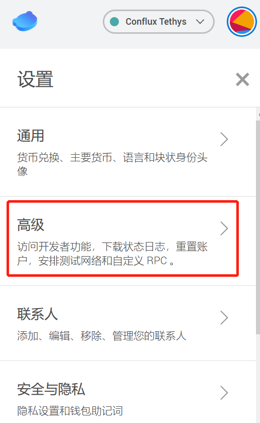
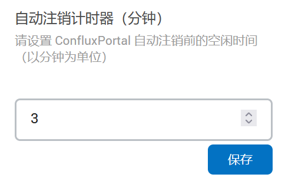
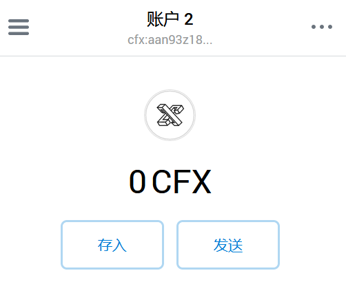
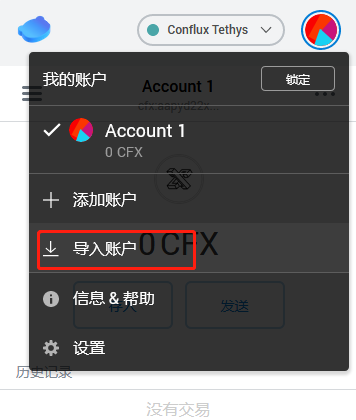

# Portal钱包常用功能解析

## 网络切换

默认情况下Conflux Portal支持

- Conflux Tethys：[Tethys Scan链接](https://confluxscan.io/)
- Conflux 测试网：[Testnet Scan链接](https://testnet.confluxscan.io/)

- 点击箭头

- 点击“Conflux 测试网”，可以发现地址前缀变为cfxtest

## 设置钱包自动锁定时间

为避免用户因遭受**木马远控**攻击而钱包因未锁定对资产带来的潜在威胁，Conflux Portal提供了自动锁定钱包的功能，可通过以下步骤进行设置：

- 点击右上角圆环->设置

- 选择“高级”

- 拉到“高级”设置最下面，自动注销计时器默认为5分钟，可自行调整：

- 修改为3分钟，保存

!!! warning

​	将自动注销计时器设置为**0分钟**，则ConfluxPortal将不再自动锁定

## 基于创建钱包时设置的助记词添加一个新子账户

该子账户仍然隶属于助记词，你可以把他理解为通过助记词派生的又一个账户，当去其他机器上使用助记词恢复账户后，您可以通过Portal中的”添加账户“操作，恢复出这一子账户

* 点击右上角圆环，并单击添加账户

- Portal专门进行了安全提示：

!!! warning

​	请注意，不要随意的分享账户私钥给他人，会出现严重的风险！

- 点击确认

- 如果点击右上角圆环，会发现我的账户内额外出现了另一个账户2

## 通过keystore文件导入账户

使用过Conflux网页钱包，其提供了一种基于keystore文件登陆Conflux钱包的方法，Conflux Portal同样支持将keystore文件导入Portal的方法恢复对应的账户，操作流程如下：

- 点击右上角圆环->导入账户

- 选择JSON文件导入：

- 点击浏览，在弹出窗口选择需要导入的keystore文件

- 选择好文件后，输入在创建网页钱包时设置的钱包登陆密码

- 点击导入，导入成功

