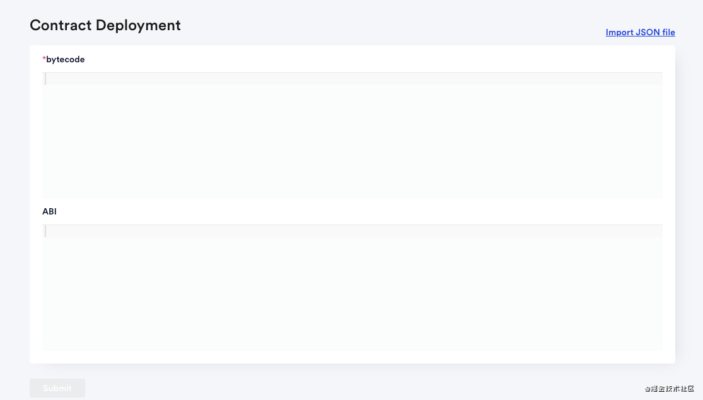
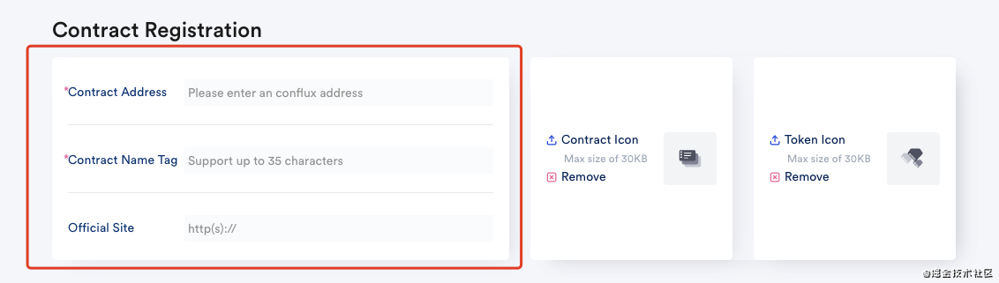
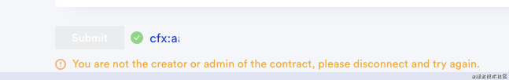

# 如何在Scan上注册合约和代币展示

## 部署合约

在Scan上将合约展示上链，第一步是将合约部署到Conflux。
打开Scan的[合约部署界面](https://confluxscan.io/contract-deployment)

- 连接 Conflux Portal 钱包

- 将[ConfluxStudio](https://conflux-wiki.github.io/conflux-wiki/development/tools/#ide)，[cfxtruffle](https://conflux-wiki.github.io/conflux-wiki/development/tools/#conflux-truffle)，[remix](https://conflux-wiki.github.io/conflux-wiki/development/tools/#conflux-remix) 编译后的 .json 文件导入（import JSON file），或手动拷贝 bytecode （必填）和 ABI （选填）。

!!! note

​	注：bytecode为必填项，ABI选填。

请注意下方的提示：

1. 合同部署即通过发送交易向 Conflux 网络发布合约代码。在部署合约之前，请确保您的帐户中 CFX 余额充足。
2. 仅支持 ConfluxStudio，cfxtruffle ，remix 编译后的 .json 文件导入；同时支持手动拷贝 bytecode （必填）和 ABI （选填）。
3. 暂不支持输入构造函数参数。
4. 您可以点击页面右上角的账户，在您的账户交易历史中查看合约部署详情。

- 点击提交，并签名交易。

- 在ConfluxScan的交易信息中，接收方地址即为创建的合约地址。

## 合约注册

部署完合约之后，此时的Scan上仍旧无法查看该合约，需要注册合约才能将合约的名字展示在Scan上。

- 点击链接打开[合约注册](https://confluxscan.io/contract)界面

在合约注册的信息栏填写合约地址和合约姓名。

- 合约姓名应当和部署合约时写在合约里的一致；合约地址应当为Conflux地址。

- 右侧上传窗口支持合约图标的上传和代币图标的上传。

!!! note

​	注：非CRC20的合约不可以上传代币图标

- 只有合约的拥有者和管理者可以上传图标，其他人上传图标会弹出提示。

## 代币展示

如果想在Scan上展示代币，需要在社区里和工作人员（cike@conflux-chain.org）联系申请审核。审核通过后，由ConfluxScan开发人员部署代币。

