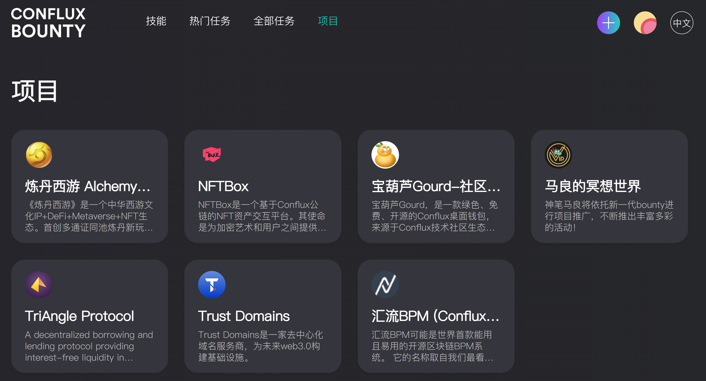

# Bounty V2 赏金任务系统

## 生态介绍

Bounty v2.0上线啦，超多项目联动：
炼丹西游、宝葫芦桌面、ConfluxBPM、NFTBox、Trust Domain、神笔马良、Tspace
超多薅羊毛任务：
绑定PandanlD、西游闯关、翻译故事、优化开发、设计海报、邀请好友、合成烤牛等

## 生态链接

- [Bounty v2公测版主页](https://bountyv2.confluxnetwork.org/#/)

- [Bounty赏金任务论坛板块](https://forum.conflux.fun/c/Chinese/bounty)

## 生态功能介绍
Bounty V2主要包括：

- 技能：指导用户安装Portal及使用社交账号绑定Panda ID

Portal安装教程可[参考链接](https://conflux-wiki.github.io/conflux-wiki/development/portal/)。

- 热门任务：探索Bounty V2的热门赏金任务

- 全部任务：查看Bounty V2中的所有赏金任务

- 项目：已接入Bounty V2的生态项目，点击进入某一个项目，可以查看该项目方发布的生态任务

## Bounty V2使用教程
官方已提供完善的Bounty V2教程，列表如下：

- [Bounty V2绑定PandaID领取CFX教程](https://forum.conflux.fun/t/bounty-v2-pandaid-cfx/12171)：绑定PandaID教程
- [Bounty v2.0 使用指南](https://forum.conflux.fun/t/bounty-v2-0/12033)：接取任务、发布任务、提交任务。
- [Bounty v2.0 常见问题解答](https://forum.conflux.fun/t/bounty-v2-0/12040)：常见问题答疑

