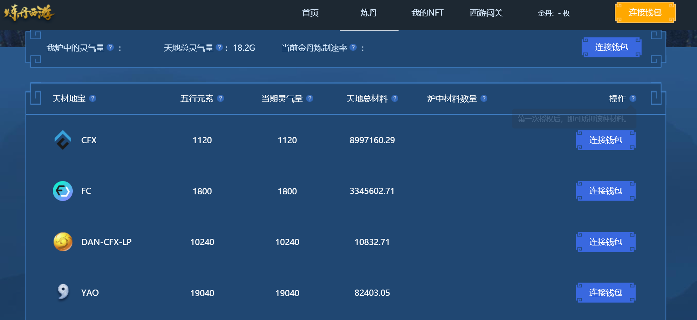
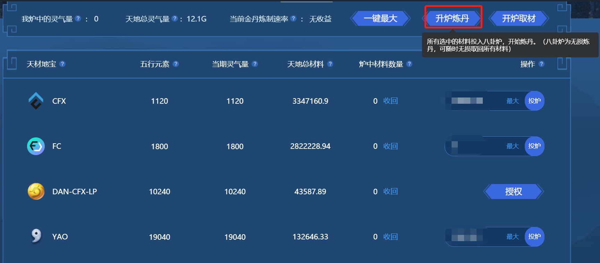
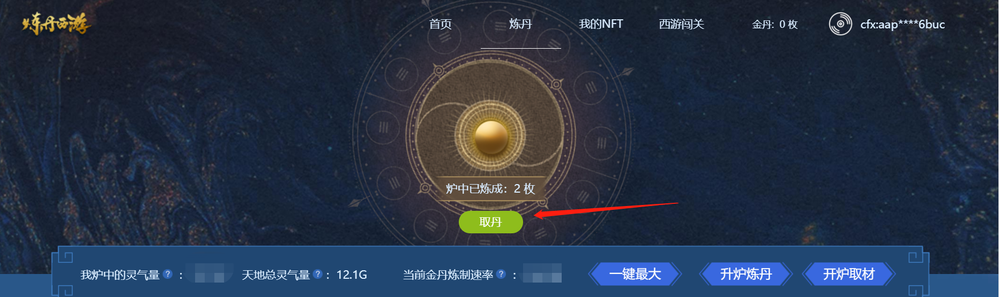

# 炼丹西游

## 生态介绍

我国四大名著中，红楼梦、水浒传、三国演艺、西游记都有经典连环画，我们有计划将它们以NFT的形式做成高清数字收藏版。对于西游记很多朋友会有个疑问：九九八十一难没有看全过，总感觉少了一些。所以我们新绘制一套按照八十一难的西游戏绘画并发行NFT，从新的角度重温取经记忆，使用区块链技术创造西游元宇宙，弘扬中华文化。现在区块链的常见DeFi玩法，每种Token需要单独建立池子，单独操作。大家拥有的区块链数字资产种类越来越多，操作越来越繁琐。很多体量不够大的资产往往没有无损挖矿的渠道，一些小额资产大家也懒得进行质押。我们首创炼丹新玩法：很多种资产可以同时质押到一个炼丹炉内获得金丹，好管好玩收益更高。同时通过轮回机制，保持金丹的价值。

本项目基于Conflux底层开发，质押C链所有代币可以炼丹。基于Conflux公链发行西游基础人物NFT和游戏关卡NFT；金丹可兑换西游基础NFT、抽取关卡NFT、交换交易、也可作为炼丹材料。

## 生态链接

- [炼丹西游主页](https://dan.finance/home)
- [炼丹西游论坛板块](https://forum.conflux.fun/c/Chinese/dan)

## 生态功能介绍
生态主页页面如下所示，主要包括：

- 主页：平台介绍及西游任务NFT展示

- 炼丹：存入各种Conflux链代币并挖丹

- 我的NFT：显示当前钱包地址内保存的西游NFT

- 西游闯关：预计**9**月上线，敬请期待

!!! note
	使用浏览器玩耍炼丹西游需要配置Conflux Portal钱包，配置教程见[Portal 安装配置步骤](https://conflux-wiki.github.io/conflux-wiki/development/portal/)

## 代币介绍
金丹DAN，Conflux宇宙总量：47304000丹，无预挖，100%通过炼丹获得，每日释放量为13500个。

金丹DAN代币合约地址：cfx:acbyzcbfpymaz43rr6s1gtx0fb08guj88uzc05rchf

可参考[添加 CRC20 代币到 Portal 的方法与步骤](https://conflux-wiki.github.io/conflux-wiki/development/add-token-to-portal/)教程，将DAN添加至Conflux Portal中，添加关键步骤如下（一些步骤已跳过）：

- 粘贴金丹合约地址到Portal自定义代币中，点击下一步及添加代币按钮后即可

## 如何挖DAN
质押各种Conflux链上代币，即可挖dan

- 访问[炼丹](https://dan.finance/deposit)页面

- 如果所有代币都想存入，直接点页面中“一键最大”，炼丹西游会自动为你设置最佳存币数目

- 点击“升炉炼丹”按钮，点击Portal或钱包中的确认交易按钮，即质押代币挖DAN

- 交易确认后，页面中将显示“灵气量”信息和炼丹速率：如炼丹速率为**10分钟**，代表您质押的币能让您每10分钟挖到一个DAN币

## 提取DAN
- 点击[炼丹](https://dan.finance/deposit)中“取丹”按钮

- 确认交易

- 取DAN成功后，页面提示“已取得金丹”

