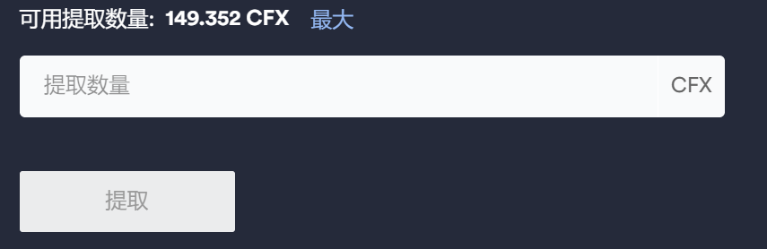

# Staking合约的质押与解质押

## Staking合约介绍
Conflux共提供了三种内置合约，你可以访问[Conflux Scan内置合约](https://confluxscan.io/contracts)了解Conflux已提供的内置合约信息。在此文中将重点介绍Staking合约，你可以访问[Conflux Scan Staking合约板块](https://confluxscan.io/address/cfx:aaejuaaaaaaaaaaaaaaaaaaaaaaaaaaaajrwuc9jnb)查看与Staking合约相关的CFX交易。

当你将CFX质押到Staking合约后，将会享受复利4.08%的年化，需要明确的是所获得的**利息将会以增发形式的CFX支付**。

**单次质押操作需要钱包里至少有2CFX，Staking最小能接受质押数额为1CFX，两者之间的关系为2-1=1**

## Staking CFX质押生态链接
- [质押CFX](https://governance.confluxnetwork.org/zh/)：需要明确的是，该系统仅支持电脑端操作

## 质押CFX教程
- 使用配置了Conflux Portal（[配置教程](https://conflux-wiki.github.io/conflux-wiki/development/portal/)）的浏览器访问[质押CFX](https://governance.confluxnetwork.org/zh/)页面，并点击右上角“连接钱包”按钮连接钱包后的页面如下图所示：

!!! note
	钱包内有150.352个CFX，为确保安全（确保钱包内有足够的CFX执行合约交互交易）可质押数量为150.352-1=149.352个CFX

- 点击“可用质押数量”旁边的“最大”按钮，会显示按最大数目质押CFX的数量

- 点击质押按钮，会自动呼出Conflux Portal，点击确认按钮以便与Staking合约交互

- 系统显示Staking交易已发出，耐心等待

- 交易执行后，发现可用提取CFX数量变为149.352CFX

## 提取CFX教程
- 点击“可用提取数量”旁边的“最大”按钮，会显示可提取的CFX数量
- 点击提取按钮，会自动呼出Conflux Portal，点击确认按钮以便与Staking合约交互并提取代币
- 刷新页面，发现钱包已提取到CFX

## 利用Conflux分析Staking交易
针对此次Staking合约交互的交易可查看[利用 ConfluxScan 分析 Staking 合约内部交互情况](https://conflux-wiki.github.io/conflux-wiki/development/internal-transaction/#confluxscanstaking)