# 古国序列

## 生态介绍

古国序列 Ancient Chinese Gods是以「中国全系列神话传说」为灵感打造的加密藏品和区块链竞技游戏。古国序列NFT收藏卡由大量艺术家原创，涉及10个创作母题和130个创作蓝本。古国序列 NFT 收藏卡集合了 DeFi 流动性挖矿和稀缺性设计，是古国序列竞技游戏的重要基础。374 天的 NFT 发行期将最少发行 130 个经典神话 IP。古国序列已经部署在Conflux公链和以太坊上。

## Token介绍

古国货币YAO 是一种 ERC20 token，总量是100W，用户可以使用质押YAO来获取XIANG，也可以通过Swap进行交易。XIANG可以抽取“古国序列”中的各类NFT 卡牌，所有古国序列 NFT 均可在 Tspace 自由交易。

爻YAO的总量是100万枚，分发采用的是线性分发，初始的14天黄金头矿，可以挖取总量的30%。在conflux 链上铸币100w,其中以太坊发行10w通过shuttleflow 跨链到以太坊.conflux 链上发行90w.古国序列将通过流动性挖矿的方式向矿工分发 YAO，矿工可质押知名 NFT 资产如 meme NFT、Moonswap 创世 NFT、FLUX NFT、烤仔NFT、古国序列NFT、Trea NFT、Yuki NFT的形式挖矿获得 YAO。

## 生态链接

- [古国序列主页](https://guguo.io/)

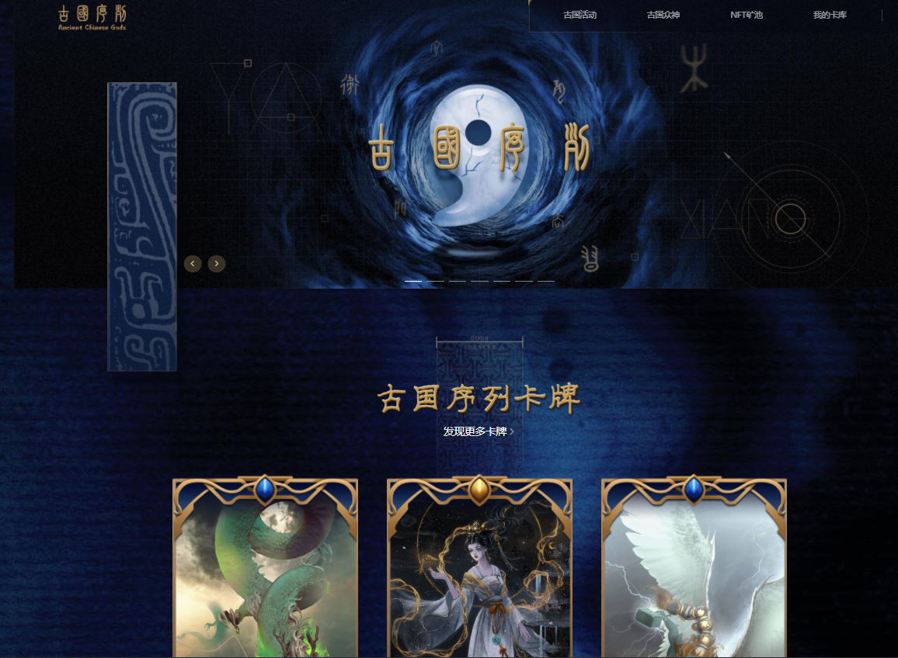

- [NFT质押挖矿页面](https://guguo.io/defi)

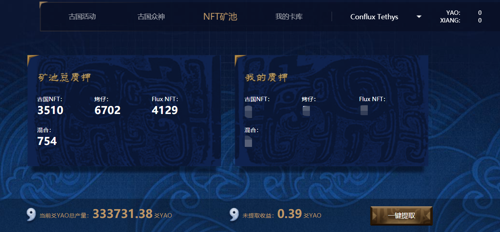

## 质押NFT挖yao

首先您需要配置一个Conflux Portal钱包，[配置教程](https://conflux-wiki.github.io/conflux-wiki/development/portal/)，且钱包中需要持有古国支持的NFT资产。

只要有古国序列支持的NFT，质押至其合约内，即可挖yao，此处以混合矿池为例，笔者持有yuki NFT和Trea NFT各一个，本节将介绍将NFT质押到古国的混合NFT矿池内挖矿的步骤。

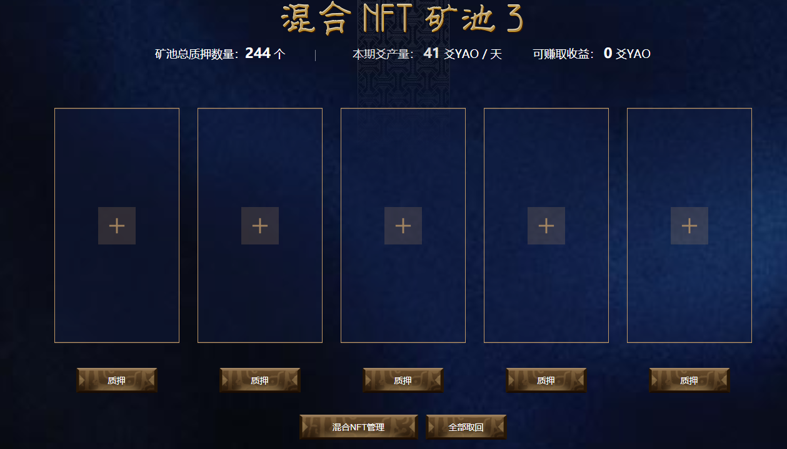

- 点击混合NFT管理按钮

- 点击上图中的“转入”按钮，勾选NFT，再次点击下图中的“转入”按钮

- 确认转入交易

- 确认成功

- 点击任意一个质押按钮

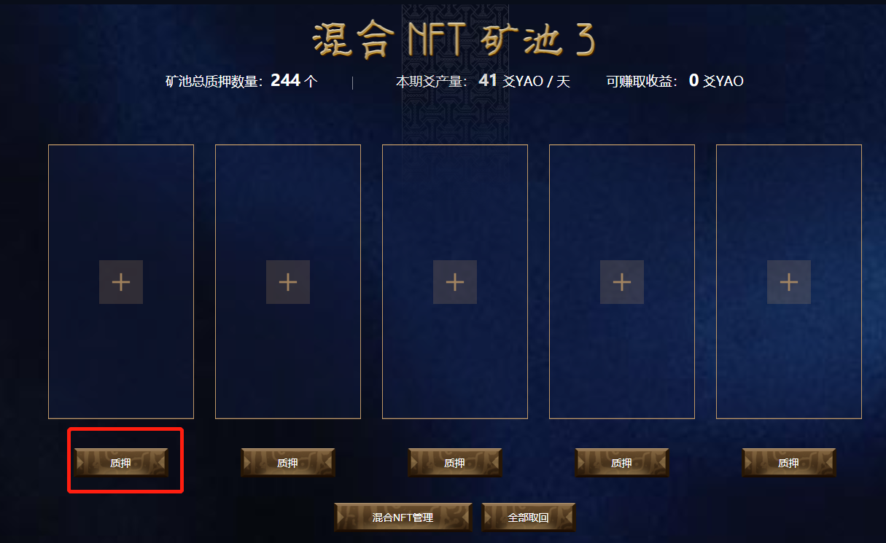

- 勾选需要质押的NFT，并点击质押按钮

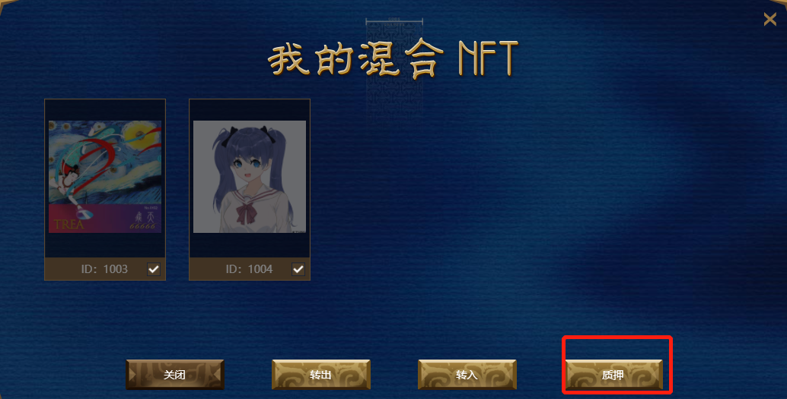

- 确认交易

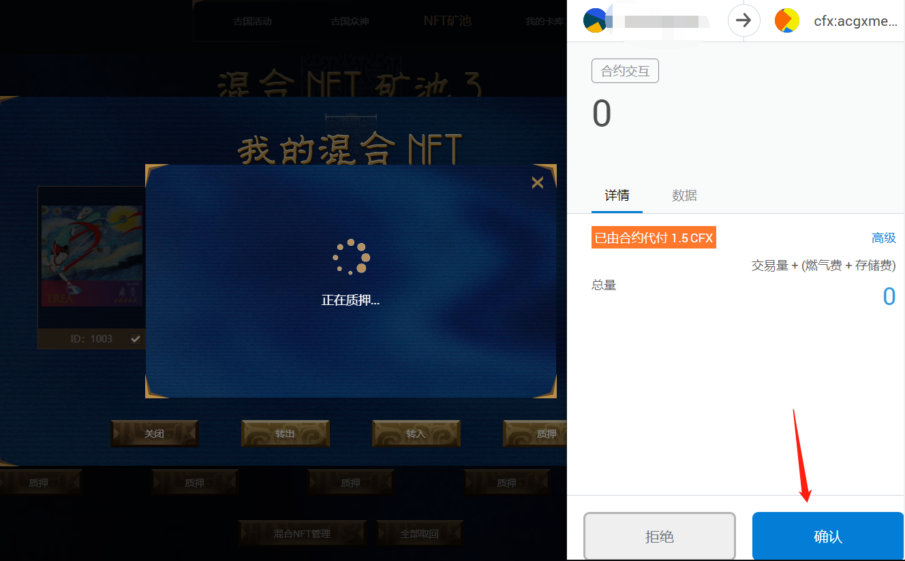

- 质押成功

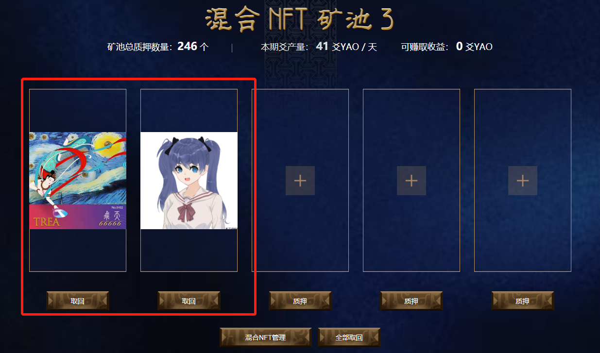

## 从混合矿池取回NFT

- 点击”取回“或”全部取回“按钮

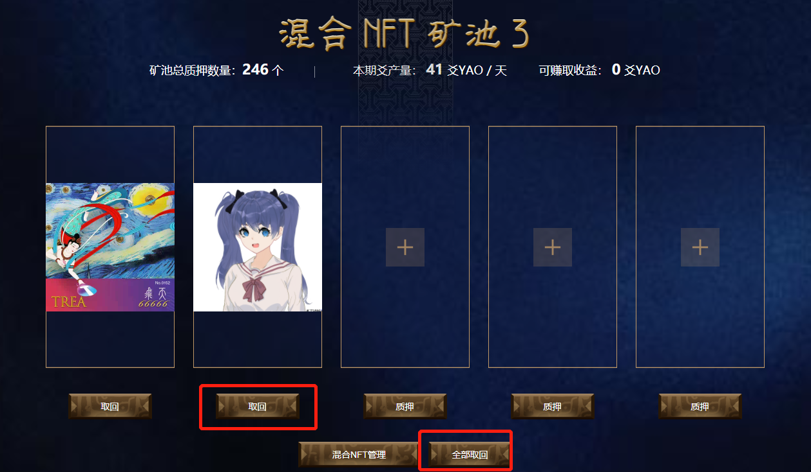

- 确认交易

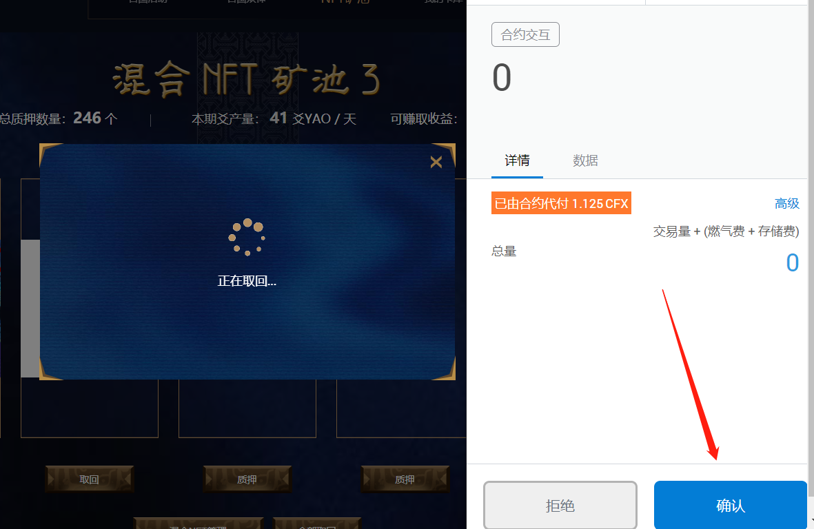

- 这时，如果你访问[Tspace我的Space](https://tspace.io/#/my-space)，你会发现自己的账户里看不到yuki这个NFT，原因是：尚未通过混合NFT管理将yuki取出到您的钱包中

- 点击混合NFT管理

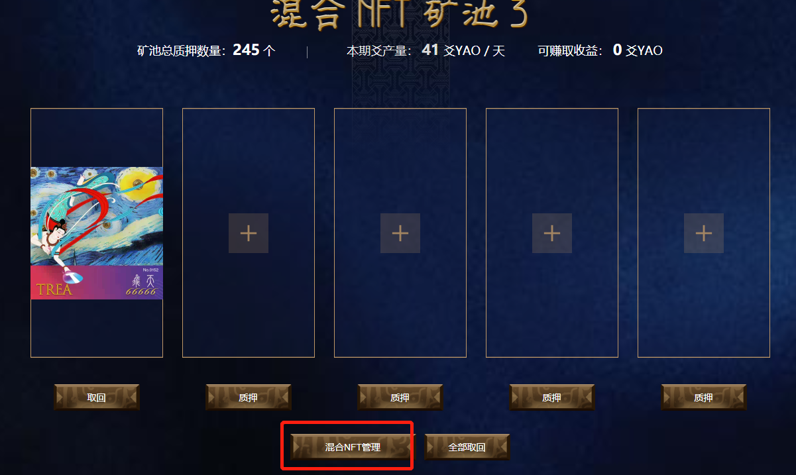

- 勾选Yuki NFT，并点击转出

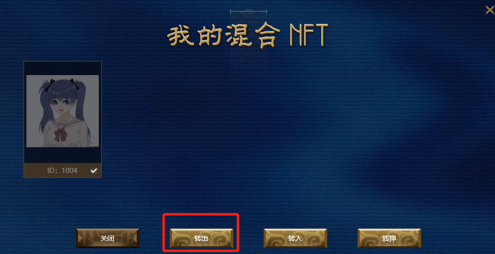

- 确认交易

- 访问[Tspace我的Space](https://tspace.io/#/my-space)，点击“刷新我的NFT”，后可以看到yuki NFT已出现

