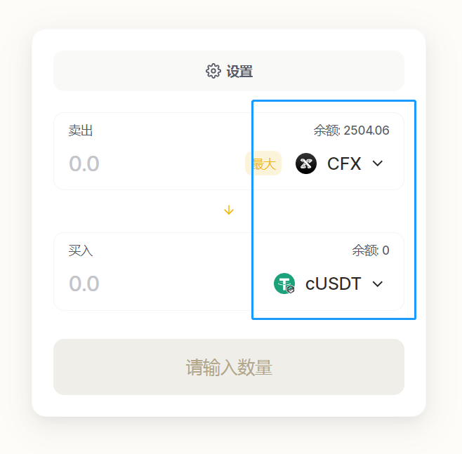
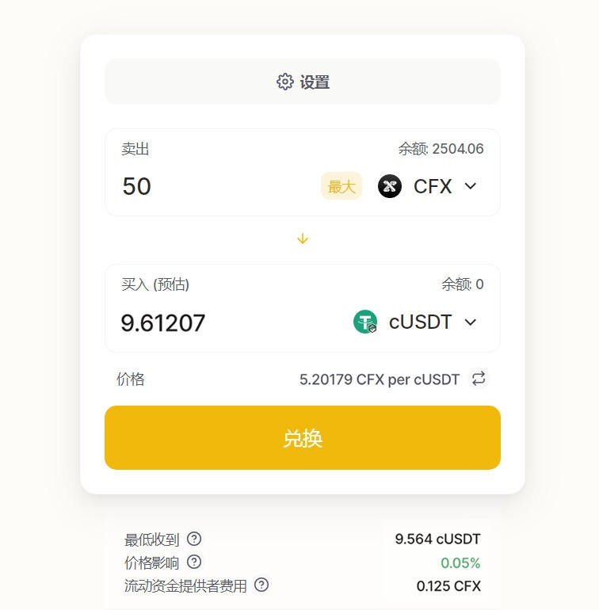
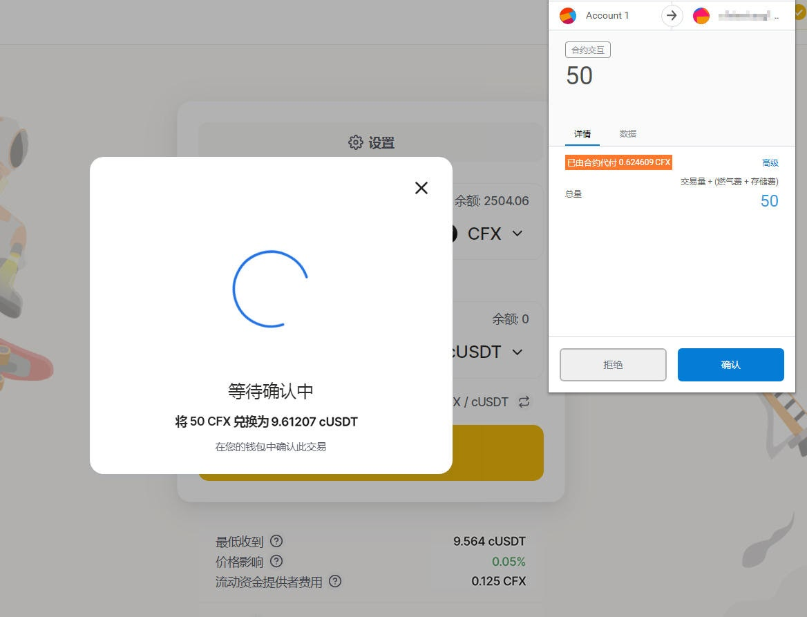

# moonswap生态

## 生态介绍

MoonSwap：基于以太坊和Conflux，具有高速、0 GAS 特性的AMM DEX，Moonswap团队开发了MoonSwap和Moon Token。它向AMM引入了第2层解决方案，因此在以太坊上持有资产的用户还可以享受“高速且0GAS费用”的体验，同时还可以实现更高的资产利用率。

## 生态链接

[Moonswap](https://moonswap.fi/)

## 使用moonswap卖出CFX购买CUSDT

- 访问[moonswap交易模块](https://moonswap.fi/exchange/swap)，点击连接钱包按钮，[Conflux Portal安装教程](https://conflux-wiki.github.io/conflux-wiki/development/portal/)

- 当弹出的窗口出现时选择要连接的钱包地址，点击 "提交"，将您的Conflux Portal 钱包连接到Moonswap

- 选择卖出Token和买入Token，如卖出CFX，买入cUSDT

- 填入兑换数量，然后按 "兑换 "按钮

- 点击 "确认兑换"；

- 在弹出的Portal交易确认中，点击确认按钮，以兑换CFX为cUSDT

- 当 "交易已提交 "窗口出现时，意味着交易已经开始执行；

- 等待几秒钟的成功信息，你就可以在ConfluxScan中查看该交易；

- 现在，也可以通过Portal查看cUSDT余额

!!! note

​	在Portal中添加cUSDT的方法见[添加 CRC20 代币到 Portal 的方法与步骤](https://conflux-wiki.github.io/conflux-wiki/development/add-token-to-portal/#1)

