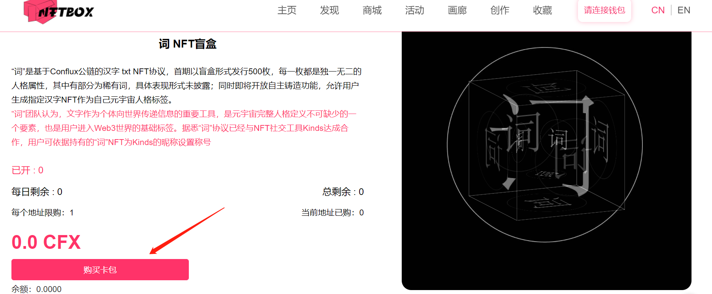
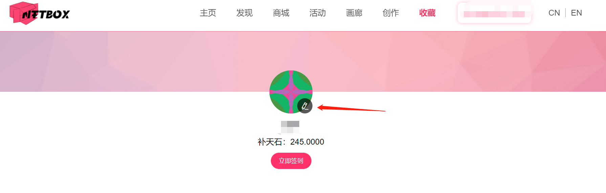
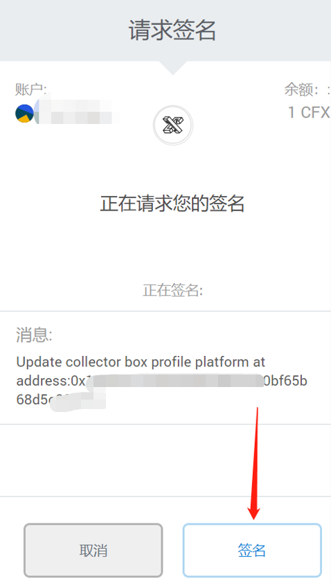
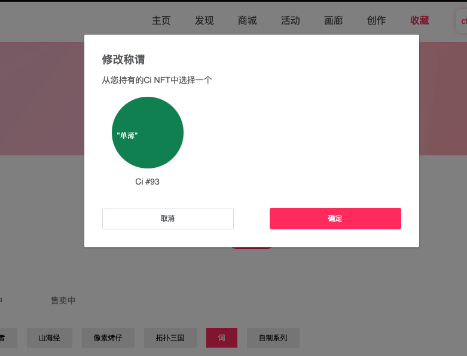

# NFTBox创新型资产交互平台

## 生态介绍

基于Conflux底层开发，力求拓展更多的NFT交互场景、解决NFT市场痛点、满足日益增加的用户需求。NFTBox采用去中心化的交易撮合，使得NFT资产交互更加安全、公开和透明。

未来将会打通三大交易所公链并逐步向其它主流公链进发，来繁荣整个生态发展。

NFTBox将秉承着用户体验为最优先级，支持手机端、PC端等多种终端产品，做一家高效、创新、有价值、用户友好的NFT交互平台。

## 生态链接

- [NFTBox 主页](http://www.boxnft.io/#/)

## 生态功能介绍
生态主页页面如下所示，主要包括：

- 主页：平台推荐的NFT资产展示与联播

- 发现：通过搜索接口发现艺术品和艺术家

- 商城：包含当前正在拍卖或一口价售卖的NFT资产

- 活动：盲盒购买等其他生态活动

- 画廊：敬请期待

- 创作：支持用户或艺术家自行上传图片并铸造NFT

- 收藏：当连接钱包后，可以查看钱包内中的NFT，签到获得补天石

## 在哪购买NFT
**在NFTBox的[活动页面](http://www.boxnft.io/#/activity)可以购买NFT**

- 点击进入按钮后，可以在页面中查看到已发售或待发售的NFT品类

- 下拉页面，可看到购买卡包按钮

- 在盲盒有剩余的时候，可以点击“购买卡包”按钮，支付token并购买盲盒

## 补天石签到教程
- 使用配置了Conflux Portal钱包的浏览器访问[NFTBox 收藏页](http://www.boxnft.io/#/collection)，系统自动呼出Conflux Portal钱包连接页面

!!! note
	需要配置Conflux Portal钱包，配置教程见[Portal 安装配置步骤](https://conflux-wiki.github.io/conflux-wiki/development/portal/)
    
- 选择需要连接的Conflux钱包账户

- 连接后，点击页面中签到按钮

- 自动呼出Conflux Portal的合约交互操作接口，点击确认即可签到获得5个补天石

!!! note
	在签到合约代付额度不足时：需要支付燃气费+存储费才能签到成功，建议在合约代付有额度的时候进行签到操作（因合约代付而不消耗任何cfx）。

## 更换NFTBox头像
在持有NFTBox头像NFT的情况下，可以将自己的个性化头像变更为您持有的NFT样式，目前已支持pixel烤仔头像。[Pixel烤仔活动介绍](https://forum.conflux.fun/t/pixelconfi/9755)

- 访问[NFTBox收藏页面](https://boxnft.io/#/collection)，连接钱包后点击头像右下角按钮

- 挑选头像

- 点击喜欢的头像：由于笔者只有一个头像NFT，只能选他

- 点击确定按钮，会呼出Portal进行签名，点击签名即可

- 头像变为Punk

## 更换NFTBox称谓
在持有词NFT的情况下，可以将个性化称谓变更为您持有词NFT所对应的内容

- 访问[NFTBox收藏页面](https://boxnft.io/#/collection)，连接钱包后点击头像下方钱包地址右侧的铅笔图标

- 在新出现的页面可查看你持有的词NFT样式

- 选中NFT，并点击确认

- 通过Portal签名交易即可更换称谓为“单薄”

