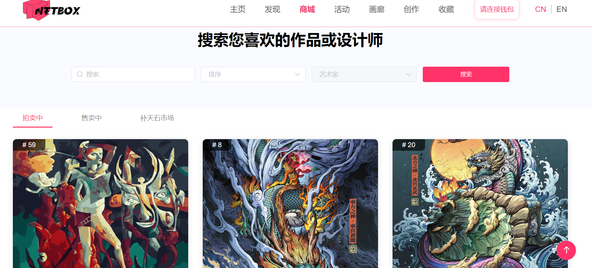
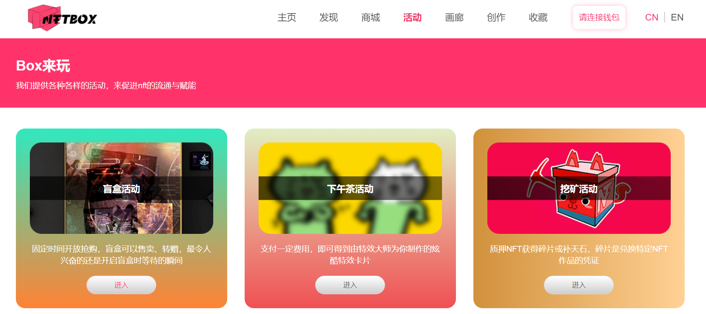
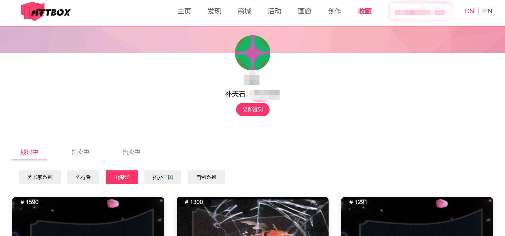
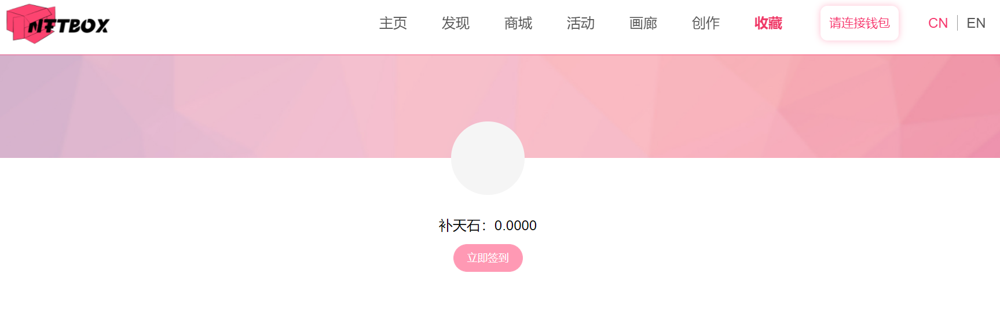
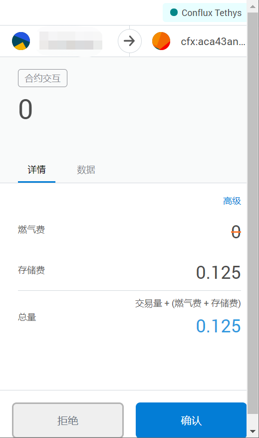

# NFTBox创新型资产交互平台

## 生态介绍

基于Conflux底层开发，力求拓展更多的NFT交互场景、解决NFT市场痛点、满足日益增加的用户需求。NFTBox采用去中心化的交易撮合，使得NFT资产交互更加安全、公开和透明。

未来将会打通三大交易所公链并逐步向其它主流公链进发，来繁荣整个生态发展。

NFTBox将秉承着用户体验为最优先级，支持手机端、PC端等多种终端产品，做一家高效、创新、有价值、用户友好的NFT交互平台。

## 生态链接

- [NFTBox 主页](http://www.boxnft.io/#/)

## 生态功能介绍
生态主页页面如下所示，主要包括：

- 主页：平台推荐的NFT资产展示与联播

- 发现：通过搜索接口发现艺术品和艺术家

- 商城：包含当前正在拍卖或一口价售卖的NFT资产

- 活动：盲盒购买等其他生态活动

- 画廊：敬请期待

- 创作：支持用户或艺术家自行上传图片并铸造NFT

- 收藏：当连接钱包后，可以查看钱包内中的NFT，签到获得补天石

## 补天石签到教程
- 使用配置了Conflux Portal钱包的浏览器访问[NFTBox 收藏页](http://www.boxnft.io/#/collection)，系统自动呼出Conflux Portal钱包连接页面

!!! note
	需要配置Conflux Portal钱包，配置教程见[Portal 安装配置步骤](https://conflux-wiki.github.io/conflux-wiki/development/portal/)
    
- 选择需要连接的Conflux钱包账户

- 连接后，点击页面中签到按钮

- 自动呼出Conflux Portal的合约交互操作接口，点击确认即可签到获得5个补天石

!!! note
	在签到合约代付额度不足时：需要支付燃气费+存储费才能签到成功，建议在合约代付有额度的时候进行签到操作（因合约代付而不消耗任何cfx）。

