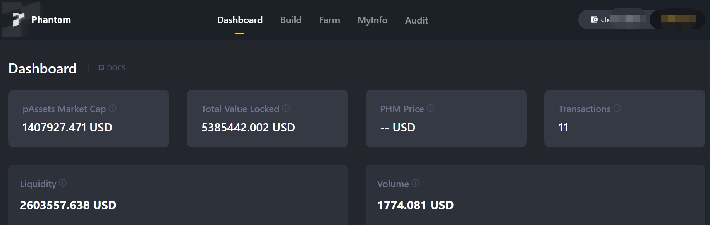
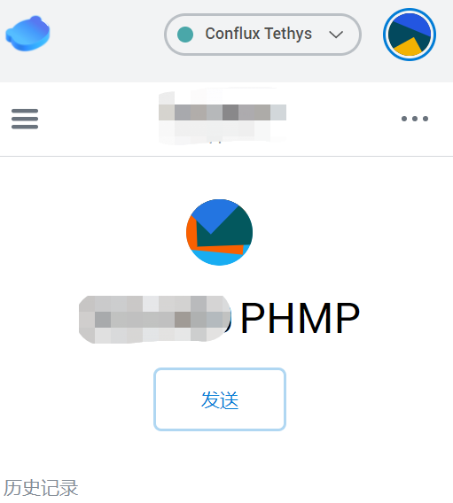

# Phantom协议

## 生态介绍

Phantom是一个跨链DeFi协议，用于创建合成资产并挖矿，甚至支持发行NFT。 Phantom users can use cryptocurrencies, NFT, and other digital assets as collateral to create synthetic assets. Phantom breaks down barriers between digital currency assets and traditional assets and lowering the threshold for ordinary people to participate in diversified investment categories.

## 生态链接

[Phantom](https://cfx.phm.finance/)
生态页面如下所示：主要包含了生态TVL，合成资产pAssets的市值，流动性统计

## 添加PHMP积分到Conflux Portal

您可以参考 [添加 CRC20 代币到 Portal 的方法与步骤-法 2：合约地址自定义添加代币](https://conflux-wiki.github.io/conflux-wiki/development/add-token-to-portal/#2)添加PHMP代币至Portal，PHMP代币的合约地址为：cfx:ach4t6n6s0zm45049b7jr19c48pws7a5x2gxafb10w。

- 添加PHMP到Portal后的显示效果如下：

