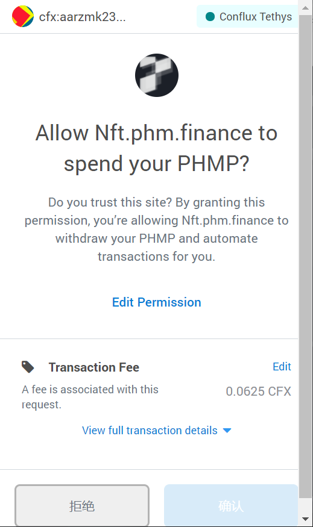
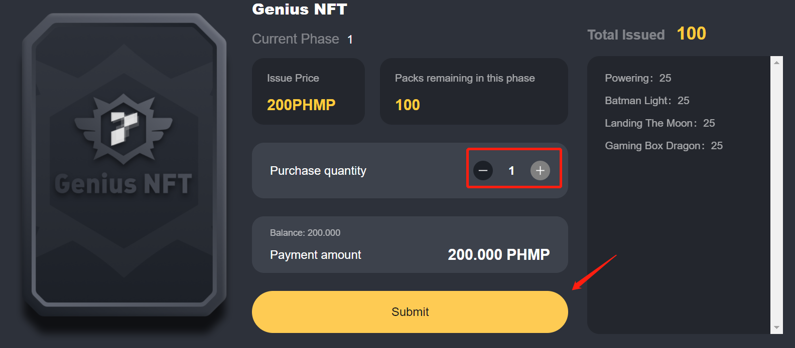
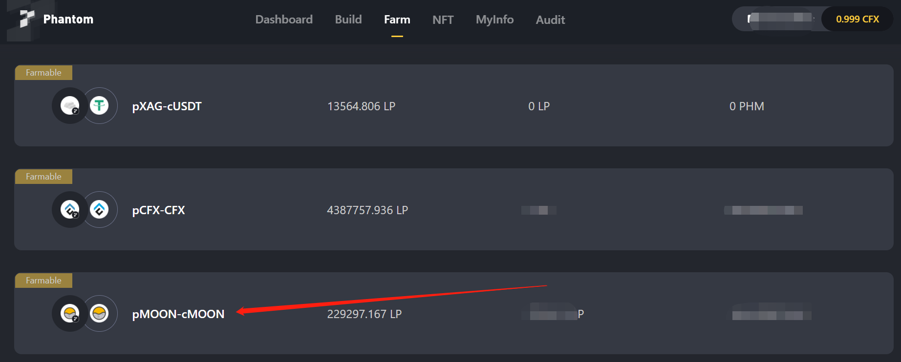
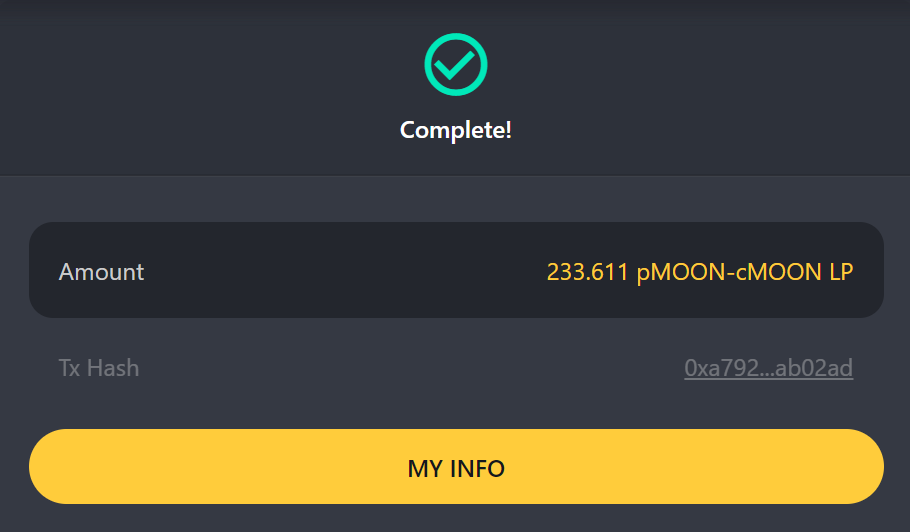
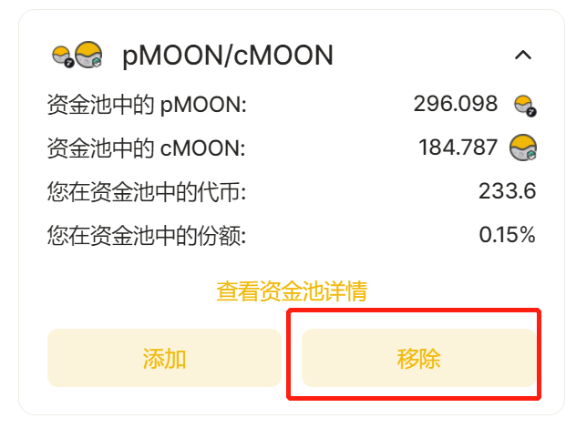
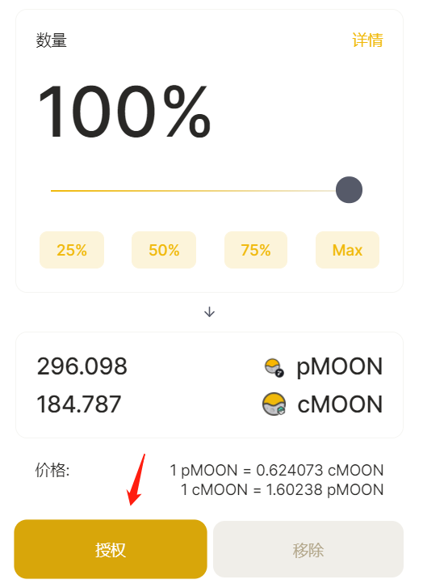
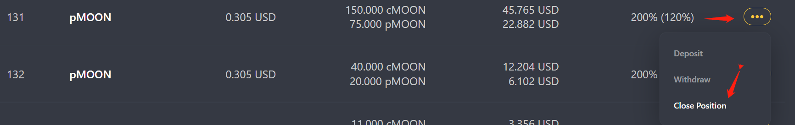
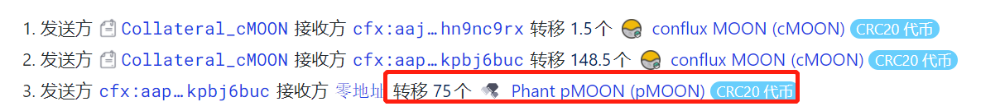

# Phantom协议

## 生态介绍

Phantom是一个跨链DeFi协议，用于创建合成资产并挖矿，甚至支持发行NFT。Phantom用户可以使用加密货币、NFT和其他数字资产作为抵押品来创建合成资产。通过这一方法，Phantom打破了数字货币资产和传统交易资产之间的障碍，有效降低了普通人参与多元化投资类别的门槛。

## 生态链接

- [Phantom Home page](https://cfx.phm.finance/)

- [Phantom英文版介绍文档](https://docs.phm.finance/)

- [Phantom代码审计报告](https://www.certik.org/projects/phantom)

生态页面如下所示：主要包含了生态TVL，合成资产pAssets的市值，流动性统计

## 添加PHMP积分到Conflux Portal

**PHMP积分可以参与[Phantom创世NFT](https://nft.phm.finance/detail?symbol=Genius%20NFT)的购买**

您可以参考 [添加 CRC20 代币到 Portal 的方法与步骤-法 2：合约地址自定义添加代币](https://conflux-wiki.github.io/conflux-wiki/development/add-token-to-portal/#2)添加PHMP代币至Portal，PHMP代币的合约地址为：cfx:ach4t6n6s0zm45049b7jr19c48pws7a5x2gxafb10w。

- 添加PHMP到Portal后的显示效果如下：

## 使用PHMP积分购买Phantom创世NFT
- 访问创世NFT[购买网站](https://nft.phm.finance/detail?symbol=Genius%20NFT)

!!! note
	需要说明的是：此次共发行100个NFT，每个NFT可以使用200个PHMP进行抢购

- 点击页面Approve按钮，授权合约能够使用您钱包地址中的PHMP

由于合约未代付，需要支付0.0625cfx的费用才能够发送授权交易

- 等待倒计时结束，选择购买数量并点击Submit按钮

- 在弹出的Portal窗口中点击确认与合约进行交互

!!! note
	抢购活动时间在北京时间8月17日中午12点14分已结束，详情可见[PHM NFT主页中的倒计时模块](https://nft.phm.finance/)。已抢到的用户记得按照如下步骤开启NFT盲盒

- 访问创世NFT[购买网站](https://nft.phm.finance/detail?symbol=Genius%20NFT)，点击 My Packs按钮后点击要打开的盲盒，此时会呼出Conflux Portal以进行合约交互，点击确认即可。

- 交易结束后点击My NFTs按钮可查看开出的NFT

## 我不想挖矿了，把钱还我！

1、幻影那边解除质押，就是在Farm那栏里面，Unstake。这个时候LPtoken就释放出来了。
2、去Moonswap把LPtoken从池子里面解除掉。就释放出来cfx跟pcfx。
3、检查LP释放出来的Pcfx数量，是不是跟你phm里面合成的数量一样。多于合成数量就可以，数量不够的，去moonswap里面换。Pcfx去幻影里面build里面Close。
4、如果剩下了pcfx，就去moonswap卖了，没有剩下，就第3步完了以后就结束了。

- 访问[farm](https://cfx.phm.finance/farm)页面，选取需要移除的挖矿LP对（以moon为例）

- 点击moon-pmoon进入页面，切换至Unstake选项卡，输入需要移除的LP对数量，此处为233.611

- 点击unstake按钮，确认交易

- 交易确认后，页面提示成功

- 访问[moonswap资金池](https://moonswap.fi/exchange/pool)解除moon-pmoon流动性

- 选择100%，点击授权，授权moonswap操作MLP

- 移除MLP，获得cmoon和pmoon代币

- 访问phantom的[my页面](https://cfx.phm.finance/my)，发现当前我们的pmoon个数能够close部分合成过的资产，进而获得cmoon

- 以close id为131的合成资产为例，关闭他，需要消耗75个pmoon

- 点击close按钮，确认交易

- 通过scan可以发现这笔交易，phantom收取了1%的手续费，销毁了75个pmoon，并返回给用户148.5个cmoon

