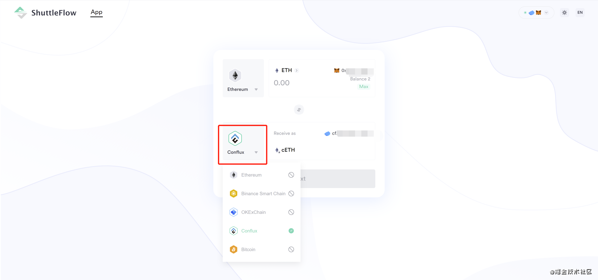
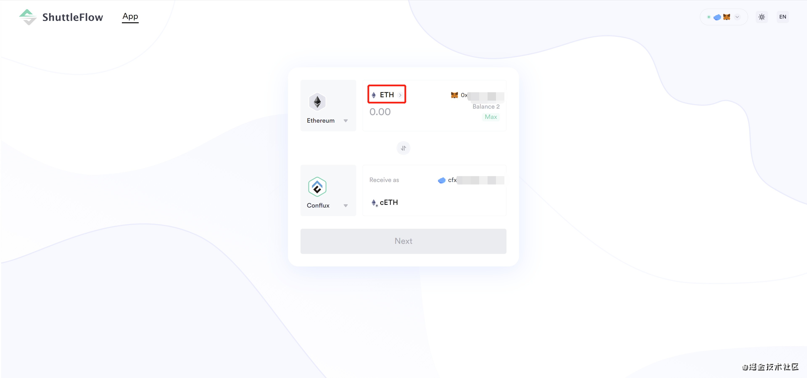
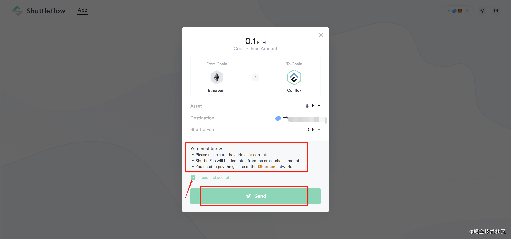
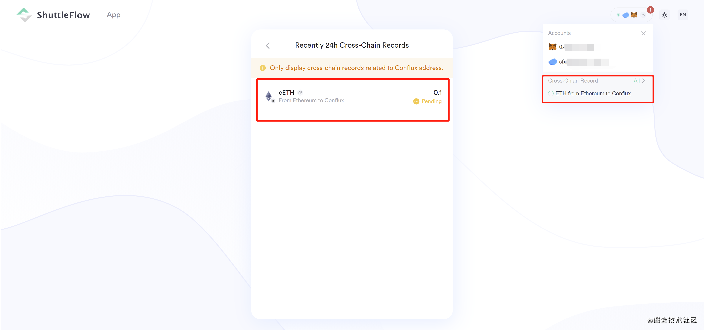
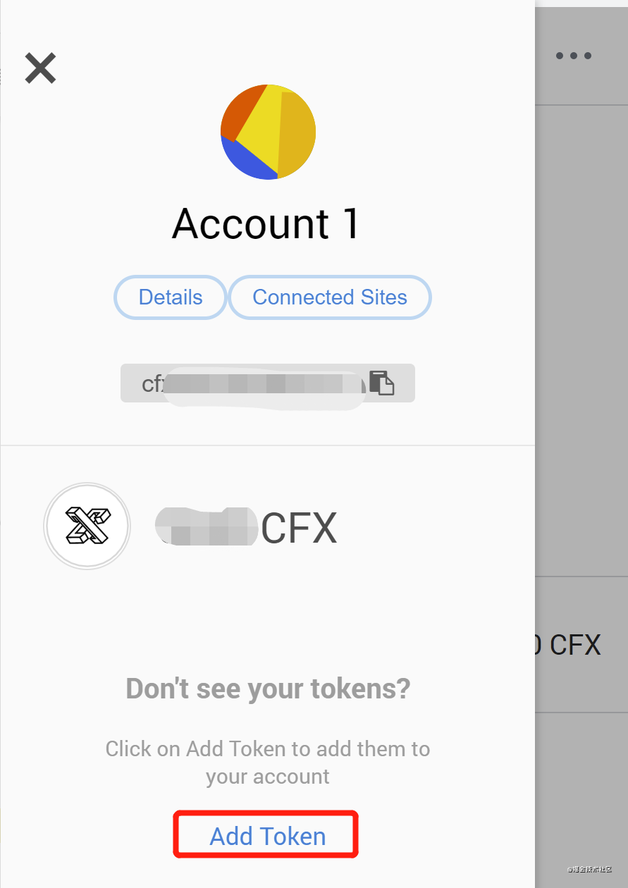
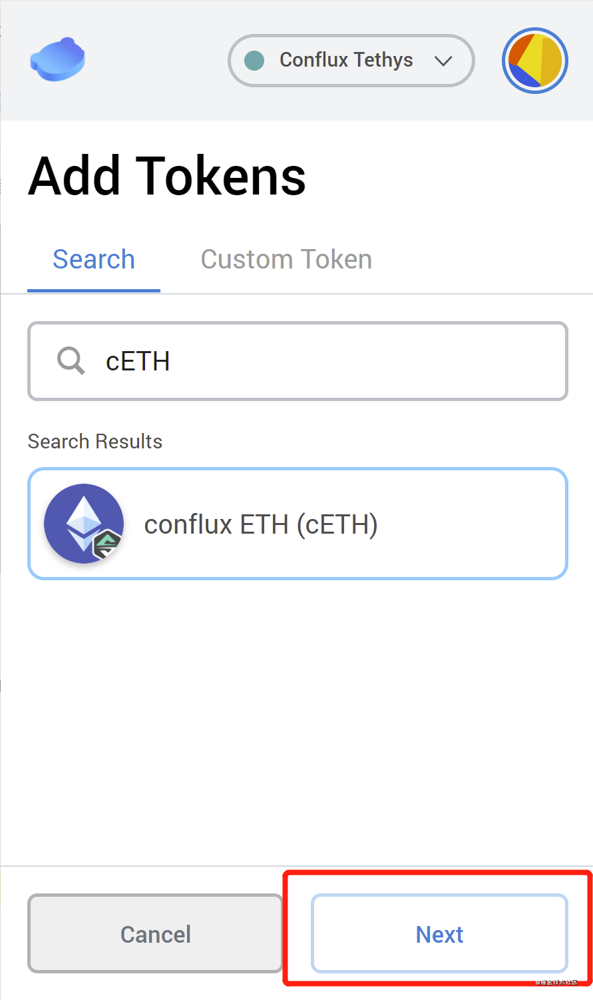

# Shuttleflow跨链工具

ShuttleFlow 通过 Conflux 链作为中继桥梁，可以快速完成多链之间的灵活跨链。

**ShuttleFlow 地址：[shuttleflow.io](http://shuttleflow.io/)**

ShuttleFlow白皮书：[white paper](https://shuttleflow.io/static/media/SF-whitepaper-zh-v1.0.75dc3b1e.pdf)

接下来介绍一下如何使用 ShuttleFlow 进行跨链，以 ETH 跨入至 Conflux 为例

## ShuttleflowV1.3跨链教程（以ETH为例）

### 1）连接钱包

点击上方“Connect Wallet”，连接 ConfluxPortal 钱包和 MetaMask 钱包。

### 2）选择跨链对

进入 ShuttleFlow 页面，在公链的下拉栏中选择 ETH /Conflux 跨链对。
注意：上方的链为资产跨出链，下方的链为资产跨入链。Gas费会通过跨出链执行。

### 3）选择代币

在代币的下拉栏中选择代币，这里选择 ETH。

注：您所持有的代币可以在所有支持 Conflux 网络的钱包中查看，比如 ConfluxPortal 。若未找到该代币，可能需要您通过“添加代币”的方式自行添加。

### 4）填入转账数额

在代币列表下方的数额中填入想跨入的代币数量，并在下方显示的 Conflux钱包地址 中确认你的**收款钱包地址**。

转账时请注意手续费的数额。

### 5）使用 MetaMask 完成转账

点击“Next”，在弹出框中确认信息无误后，勾选 “I read and accept”，点击“Send”。

请务必知晓：

- 请务必确认地址准确无误
- 跨链手续费将会在跨链交易数量中扣减
- 你需要支付 Ethereum 网络的 Gas 费

在 MetaMask 弹出框中确认交易即可。等待所有链上交易确认后，就跨入成功了，在 Conflux 账户中会收到 cETH。

成功提交交易后，可以点击“View on Scan”跳转到 ConfluxScan 区块浏览器上查看交易信息

也可以点击右上角的红点查看交易记录。

注：
1.请确认可以接收对应代币资产的钱包地址，否则资产将不可找回。
2.跨链需要一定数量的区块确认才能到账，可以在历史记录或区块链浏览器查看进度
3.ShuttleFlow 是真正的去中心化产品，在任何情况下都接触不到用户的私钥。
4.您的资产托管在智能合约 ShuttleFlow 中，合约通过第三方安全审计，并由 ShuttleFlow 跨链资产联盟多重签名防护。即使 ShuttleFlow 自身私钥泄露，黑客也无法盗取用户资产，平台自身也无法作恶。

### 6）查看自己 ConfluxPortal 钱包中是否收到 cETH

点击右上角菜单栏

选择“Add Token”

输入“cETH”并选择“NEXT”-“Add Tokens”，便可在 ConfluxPortal 中看到 cETH。

