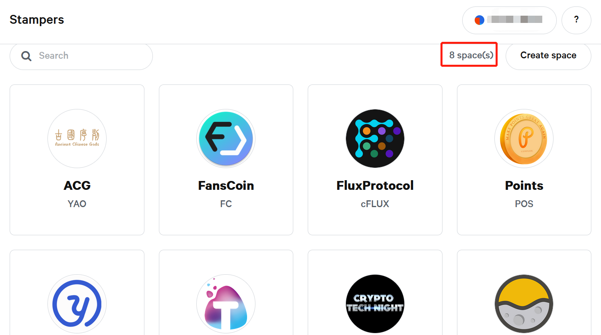
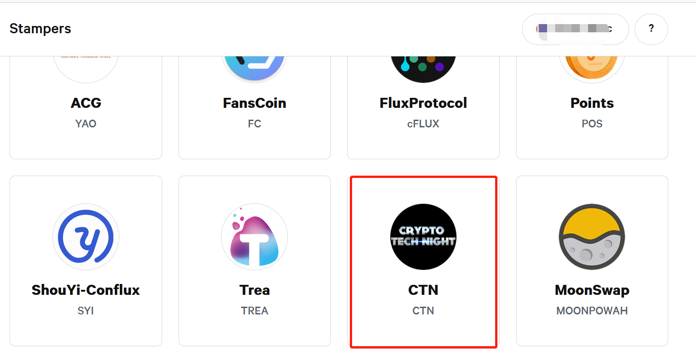
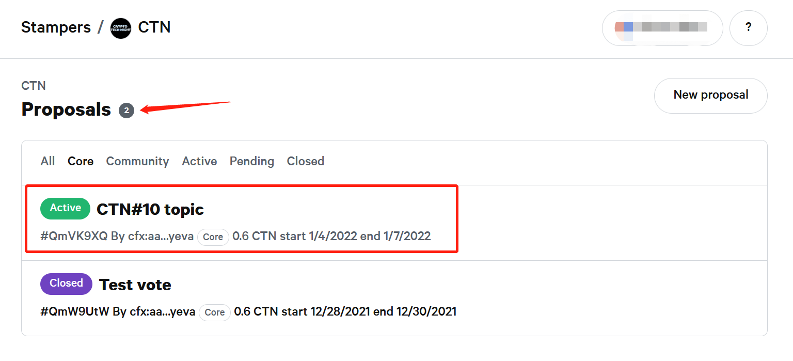
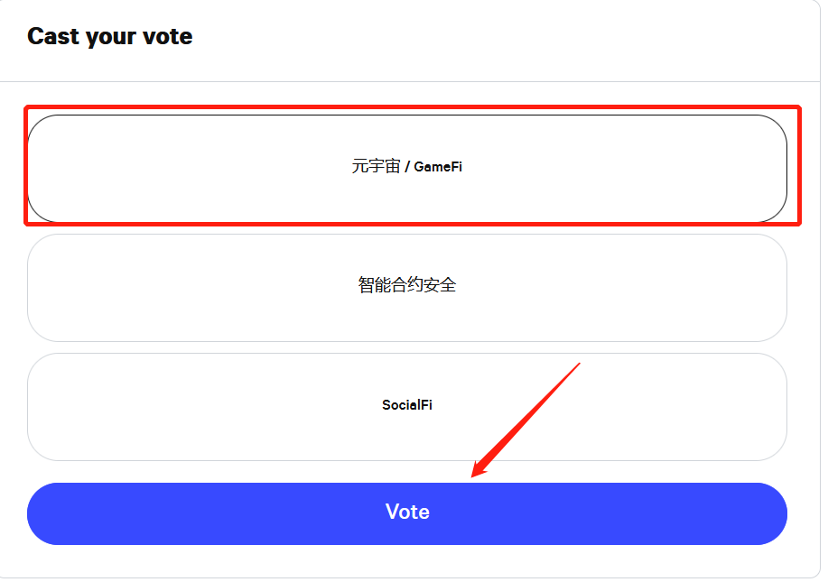
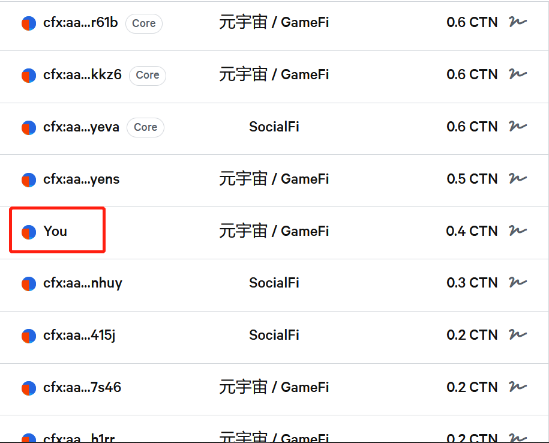

# Stampers

## 生态介绍

Stampers是一款无需花费燃料即可参与多方DAO治理的投票系统，其具有结果易于验证且难以被恶意竞争的特点。Stampers是以snapshot系统为基础经重构适配使其能够在Conflux网络中使用并开展DAO治理活动。

## 相关链接

- [开源仓库](https://github.com/Proposal-Stampers/stampers)：**需要申请在stampers开辟治理空间的开发者需要重点关注该链接**
- [Stampers治理系统](https://stampers.app/#/)：**访问该链接参与投票治理**

## 界面信息

通过访问[Stampers治理系统](https://stampers.app/#/)，可发现目前共有8个项目在Stampers开辟了治理空间

## 使用教程

- 以笔者参与CRYPTO TECH NIGHT治理为例，在stampers中找到CTN的治理空间

- 点击进入治理空间，可以看到目前一共有2个提案，其中active状态的提案可参与

- 点击进入 **CTN#10 topic**治理，选取感兴趣的选项并点击Vote

- 确认投票

- 在呼出的Portal中点击Sign按钮签名交易使投票确认

- 静待交易确认即投票成功

