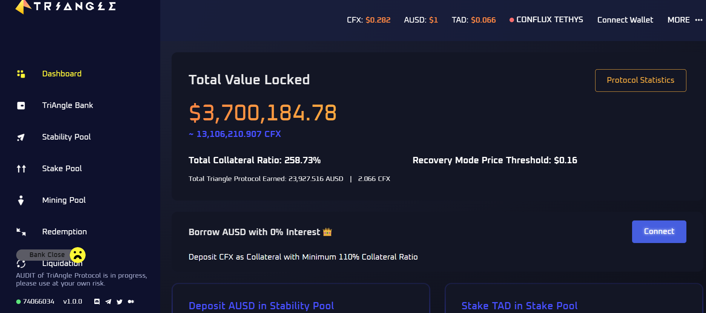
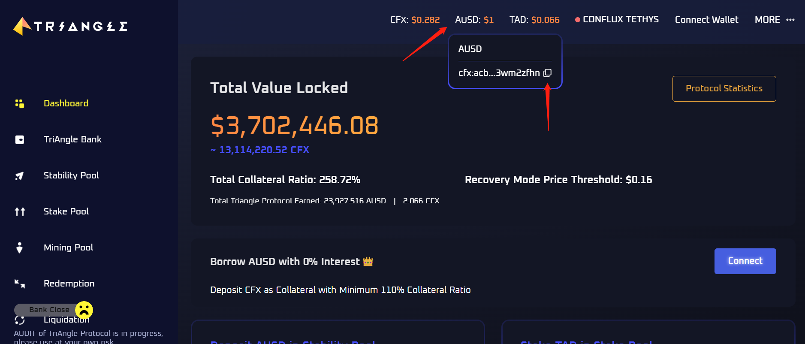
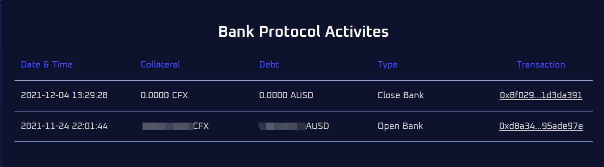

# Triangle DAO

## 生态介绍

TriAngleDao(社区习惯称之为三角道，简称TAD)，三角道是一个基于CFX的稳定币项目。其主要思想是，通过超额抵押CFX，从三角道处借出稳定币AUSD，一种与美元1：1锚定的链上代币。且CFX抵押率不得低于110%。即每一枚aUSD背后有不低于价值1.1U的CFX抵押。TriAngle DAO 是一款全球通用的稳定币协议，能够在任意位置的任意用户在任意时刻提供完全无息的稳定币，旨在为那些无法使用银行服务的用户提供类似银行的服务。以Conflux网络为例，TriAngle DAO是一款能够通过抵押CFX生成稳定币AUSD提供无息流动资金的协议。通过运用先进的清算机制和基于算法的货币政策，能够为借款人提供一定的优势和好处。

## 生态链接

- [TriAngleDao主页](https://app.triangledao.finance/)

## 项目细节

## 生态功能介绍
TriAngleDao的功能主要包括：

- Dashboard：仪表板，查看三角道的协议TVL信息，锁仓CFX量，抵押率（Total Collateral Ratio），恢复模式的价格阈值（Recovery Mode Price Threshold）等，如果连接Portal钱包还会显示用户自己借出AUSD的总量信息，抵押率等重要信息。

Portal安装教程可[参考链接](https://conflux-wiki.github.io/conflux-wiki/development/portal/)。

- TriAngle Bank：抵押CFX借出AUSD，开启银行。

- Stability Pool：稳定币质押池，存入AUSD，挖取平台币TAD，在出现清算时，存入的AUSD按比例瓜分清算CFX（以优惠价购买，原因是被清算者在借出AUSD时至少需要保证抵押的CFX对应的抵押率为110%）

- Stake Pool：质押池，存入平台币TAD（带锁仓机制），瓜分AUSD手续费，CFX及TAD等代币，目前暂时只发现AUSD有产出

- Mining Pool：挖矿池，目前还未开放

- Redemption：利用AUSD赎回CFX，三角DAO将会根据账户抵押率的情况，由抵押率低->抵押率高进行排序，利用AUSD偿还对应账户的AUSD债务，以换取对应账户的抵押物

- Liquidation：清算，在有账户抵押率过低时，通过点击按钮，提醒三角道有账户需要清算了，这时三角dao会利用抵押在Stability Pool中的AUSD回购待清算账户的CFX，并销毁购买这些CFX的AUSD，同时提醒合约需要清算的账户将获得20AUSD的提醒奖励

## 三角DAO使用教程
社群热心成员aloner已提供相对较为完善的三角道使用教程：

- [Aloner论坛教程](https://forum.conflux.fun/t/triangledao-koichiswap/12460)

## 添加三角DAO代币到Portal钱包教程
Portal钱包目前还不支持直接通过名称搜索，那么只能麻烦乡亲们用合约地址添加了，合约地址在哪找？访问[三角道官网](https://app.triangledao.finance/)，右上角即可复制AUSD合约地址，TAD同理，鼠标移动过去，合约地址就出现了，直接复制就行。

- 添加通过合约地址添加CRC20代币到Portal钱包教程早就写好了，[参考链接](https://conflux-wiki.github.io/conflux-wiki/development/add-token-to-portal/#2)

## 查看使用三角DAO开启或关闭银行的历史
- 访问[三角DAO首页](https://app.triangledao.finance/)，连接Portal钱包后发现页面中出现“View History”按钮

- 点击按钮查看操作历史

