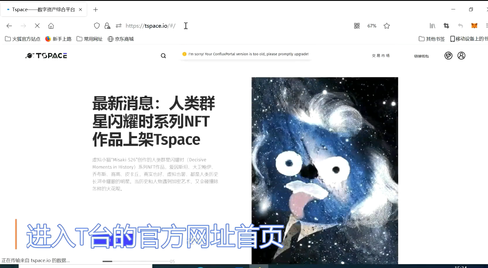
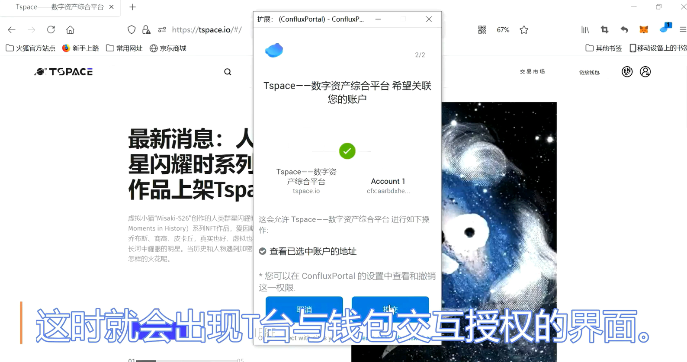
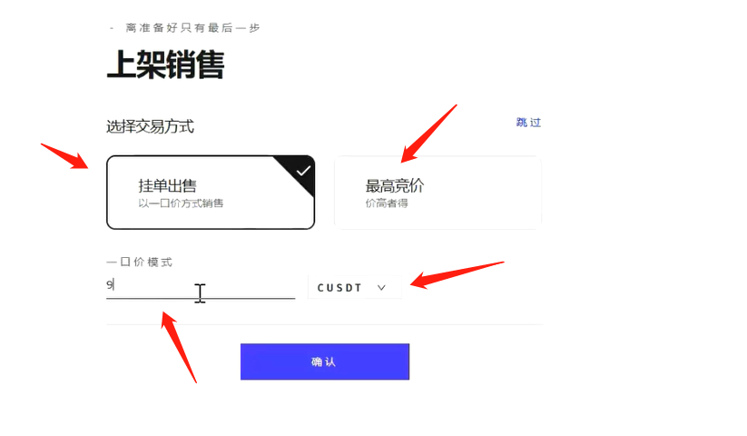
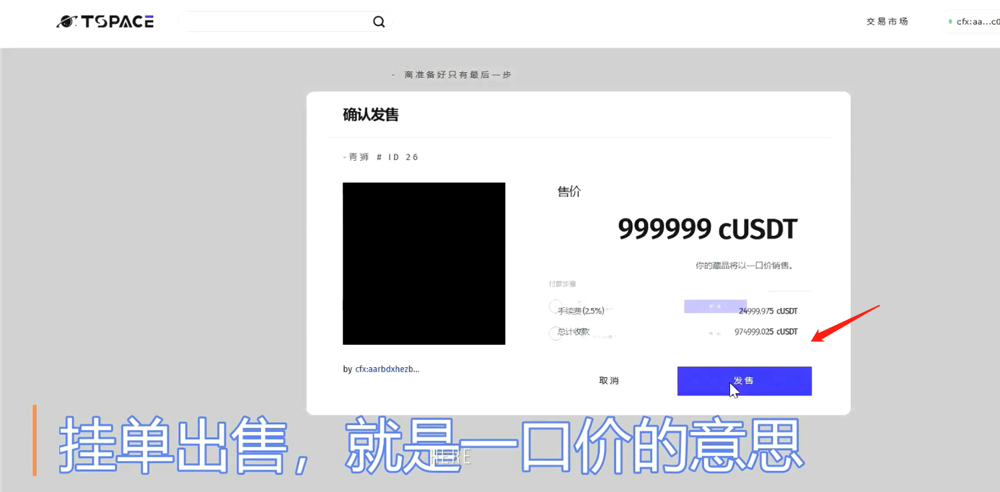
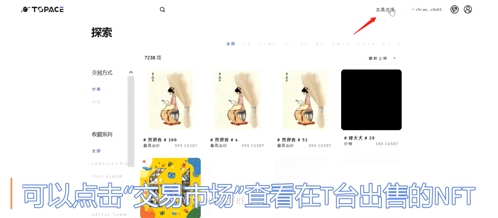
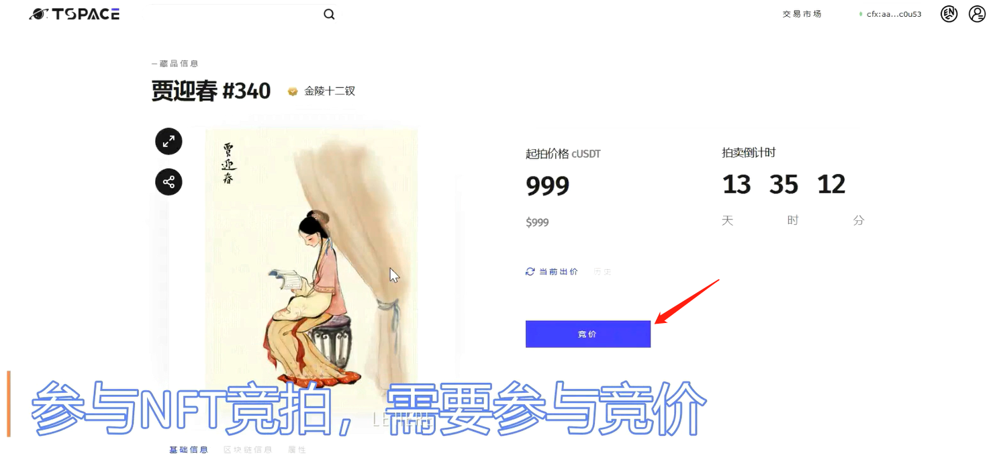
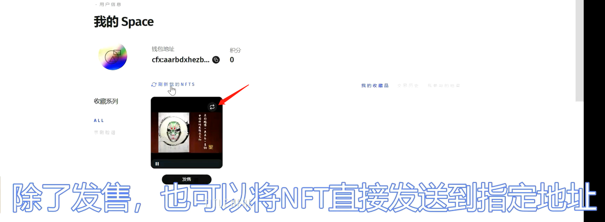
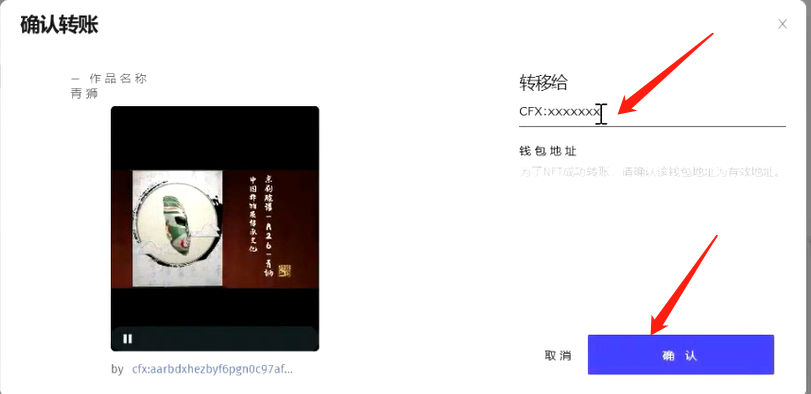

# Tspace 4.0 NFT平台

## 基本介绍

Tspace是首个基于树图（Conflux）区块链网络的去中心化数字资产交易平台，能够服务于多方客户管理数字收藏品NFT（Non-Fungible Token）的需求。NFT具有独一无二、稀缺性、不可复制的独特属性，可应用于多种虚拟与现实应用场景。Tspace凭借Conflux网络高速、安全、低成本的技术优势，能够更好地支持NFT的铸造、展示和流通，为用户提供一个开放和包容的综合管理平台，和一个健康繁荣的商品市场数字数字经济。作为一个纯由Conflux技术社区孵化的生态项目，Tspace团队通过创新技术和平台优势为加密艺术家及收藏者们提供一个优质的数字资产管理平台，建立Conflux链上非同质化的可操作合约标准，为开发者，艺术家、有想法的用户提供一个工具和集成市场。Tspace团队致力于探索和实践普及区块链技术的方法，引导人们走进神奇的加密艺术世界，享受科技给生活带来的改变。

## 生态链接

[Tspace--数字资产综合平台](https://tspace.io/)

## 使用Conflux Portal接入Tspace

!!! note

​	Conflux Portal配置教程见[Portal 安装配置步骤](https://conflux-wiki.github.io/conflux-wiki/development/portal/)

- 使用配置了Conflux Portal钱包的浏览器访问[Tspace首页](https://tspace.io/)

- 点击右上角“链接钱包”按钮

- 授权成功后，即代表对应钱包地址接入Tspace成功。

## 使用Tspace以一口价形式售卖钱包内已有NFT

- 当钱包接入Tspace后，点击右上角“个人中心”图标

- 通过个人中心可查看到当前钱包地址所持有的NFT：

- 点击NFT下面的“发售”按钮，可出售自己持有的NFT

- 以一口价模式出售，即代表必须付出设置的价格，才能买下该NFT，如设置为999999CUSDT价格，即他人需要支付999999CUSDT才能买到该NFT。

- 点击上图确认按钮后，弹出“确认发售”界面

- 点击“发售按钮”，会弹出“签名”->“授权”

- 签名会发起一个Portal交易，确认即可，授权同理，燃气费用由conflux代付

- 刷新页面可看到出售状态

## 使用Tspace以拍卖形式售卖钱包内NFT

- 在上架销售时，选择“最高竞价”，设置起拍价和截至日期

- 竞拍时间可选择24,48或72小时

## 使用Tspace购买NFT（一口价/竞拍）

- 点击右上角“交易市场”，查看正在出售的NFT

- 可通过筛选功能筛选感兴趣的NFT

竞价模式，不会立即支付费用，只需确保钱包里有足够的余额足以支付NFT费用，待拍卖结束后会自动抵扣款项

一口价模式：交易目录下NFT可以直接一口价购买

## NFT转账

- tspace支持NFT转账给任意Conflux合法钱包地址，NFT右上角有一个按钮，点他

- 填写地址，点确认按钮，注意不要填写合约地址

