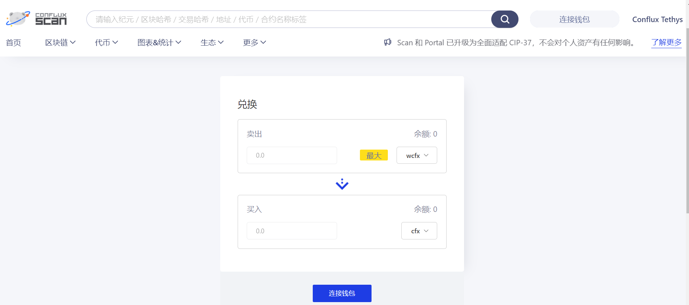
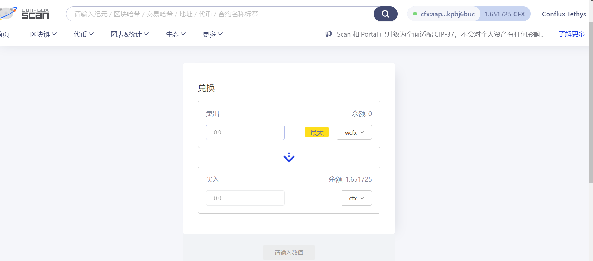
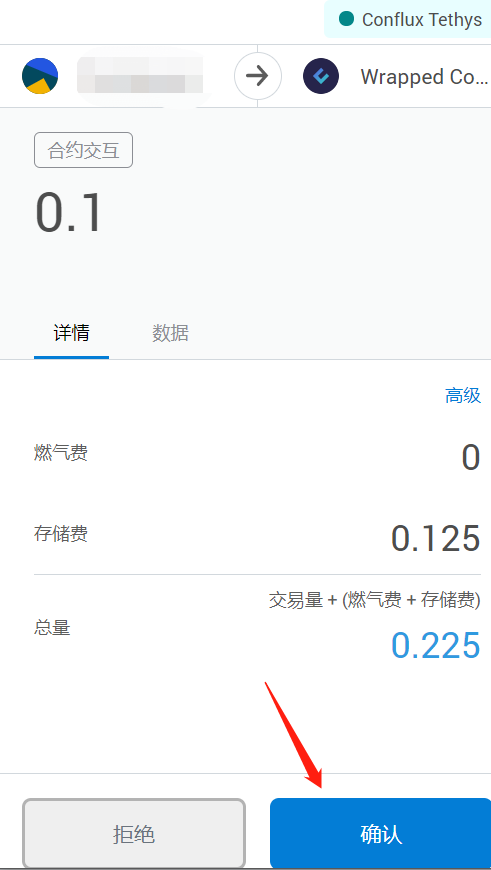
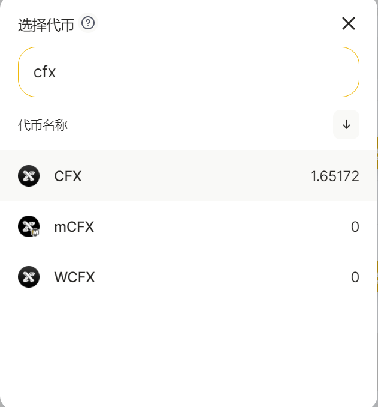
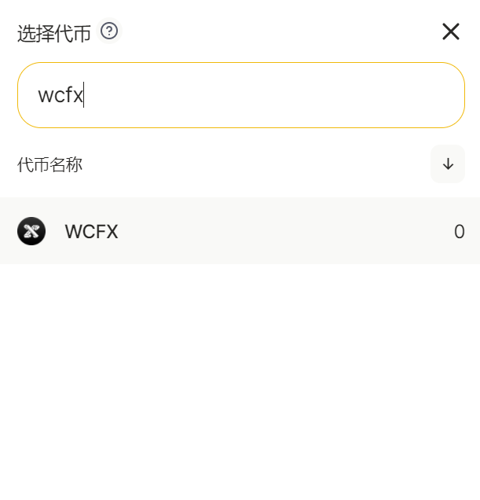
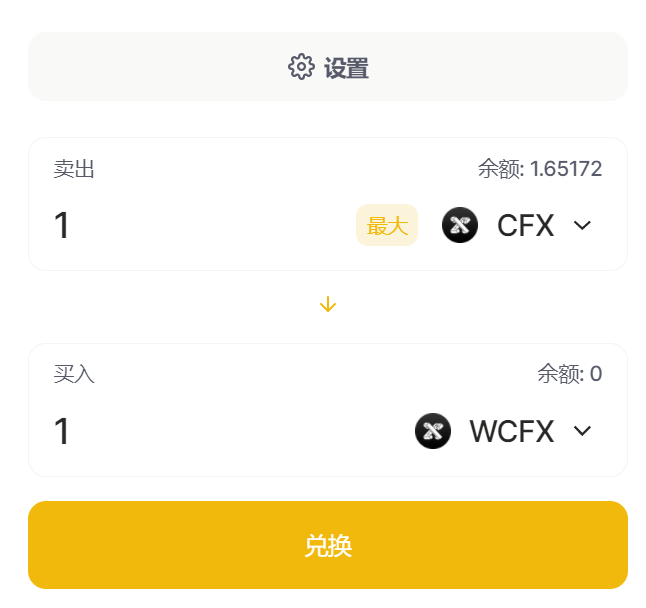

# WCFX与CFX代币互换

## WCFX介绍
WCFX是经过CRC20 wrapped处理过的CFX，原则上WCFX与CFX按照1:1比率进行兑换，通常在使用Tspace这类生态购买特定NFT时，需要使用WCFX作为支付币种。

- WCFX代币可通过Confluxscan查看：[Wrapped Conflux](https://confluxscan.io/token/cfx:acg158kvr8zanb1bs048ryb6rtrhr283ma70vz70tx)
- 需要配置ConfluxPortal，[配置教程](https://conflux-wiki.github.io/conflux-wiki/development/portal/)

## CFX与WCFX互换的两种方式

- 使用Confluxscan自带cfx-wcfx兑换器进行兑换：[兑换链接](https://confluxscan.io/swap)
- 使用moonswap的swap系统进行兑换：[兑换链接](https://moonswap.fi/exchange/swap)

## 使用Confluxscan兑换cfx为wcfx的方法（需要付存储费）

* 访问[兑换链接](https://confluxscan.io/swap)，右上角连接钱包

* 连接钱包

* 由于希望用cfx兑换为wcfx，需点击页面箭头

* 输入希望兑换的cfx数目

* 点击兑换按钮，并在弹出的Portal中点击确认，兑换完成

## 使用moonswap兑换cfx为wcfx的方法（无需支付存储费）

- 访问moonswap的[swap模块](https://moonswap.fi/exchange/swap)

- 由于我们要用CFX换WCFX，所以卖出里选“CFX”，买入里选择“WCFX”

- 输入需要卖出的CFX量

- 点击兑换，呼出Portal确认，点击确认即可

!!! note

​	如果反悔不想兑换cfx为wcfx，可以直接点击拒绝！