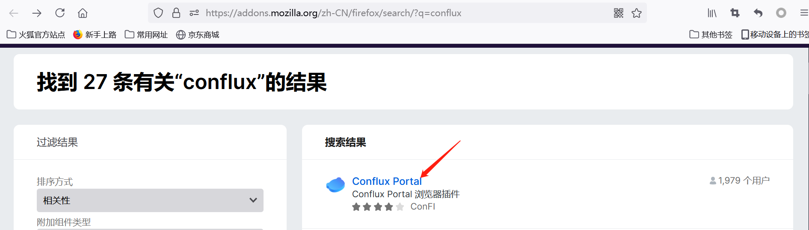
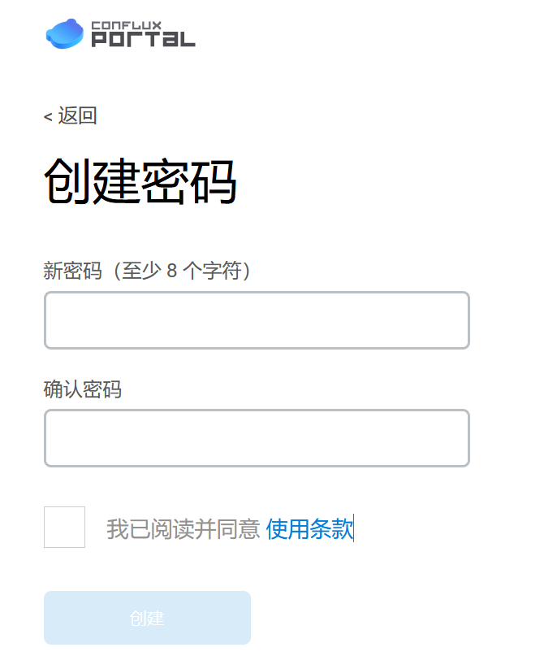
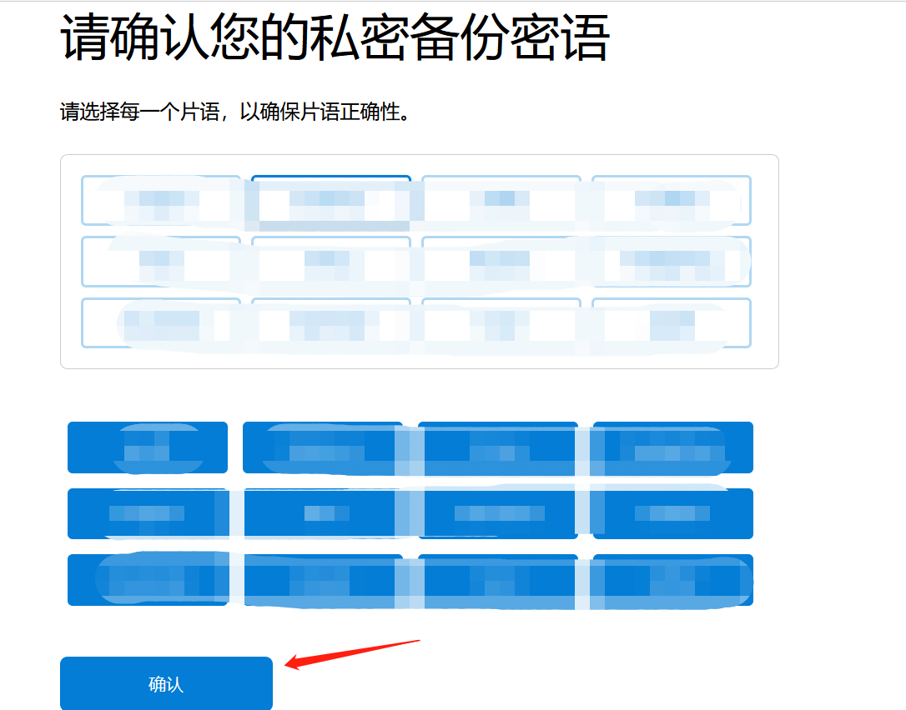

# Portal安装

考虑到部分同志FQ难的问题，特使用火狐浏览器给各位观众老爷们进行展示

## 下载火狐浏览器

访问[Firefox官网](http://www.firefox.com.cn/)：点击“立即下载按钮”

## 安装Portal

- 搜索“conflux”关键字

   

- 点击“Conflux Portal”

   

- 点击“添加到Firefox”

   

- 点击“添加”按钮

   

- 安装完成

   

- 点击开始使用

  

- 同意

  

- 设置“解锁密码”

  

- 勾选同意

  

  !!! warning

  这里尤其要注意保存好密语，不要让别人看到！！！

- 备份密语

  

- 点击此处显示暗语，记录，并点击下一步，按序选择助记词，点确认

  

- 点击全部完成

  

- 这是可通过浏览器侧边栏访问Portal

  

- 输入密码，解锁

  